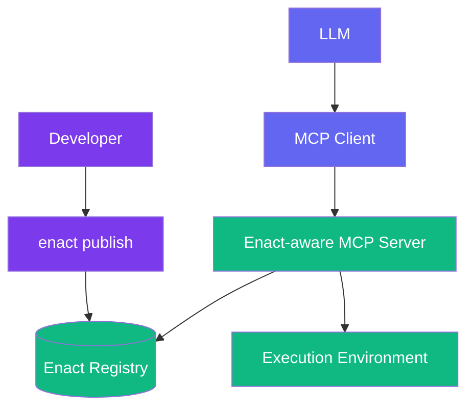

# Enact Protocol

  [](https://discord.gg/mMfxvMtHyS)

## What is Enact?

**Enact** revolutionizes how AI tools are defined, packaged, and shared.

Enact is a protocol that complements the [Model Context Protocol (MCP)](https://github.com/modelcontextprotocol) by providing a standardized way to define, package, discover, and secure AI tools.

While MCP enables communication between AI models and tools, **Enact handles the complete lifecycle of those tools**—ensuring they are:

* 🌐 **Discoverable** — semantically searchable across registries
* 📦 **Packaged** — defined in a consistent, executable format
* 🔐 **Secure** — protected with cryptographic signatures
* 🕒 **Reproducible** — versioned with commit pinning for reliability

> **Enact provides the standards for packaging, securing, and discovering tools**

---

## 🧠 How Enact Extends MCP

MCP defines [tools](https://modelcontextprotocol.io/docs/concepts/tools) with a basic structure, but doesn't address the complete tool lifecycle. Enact fills this gap:

```yaml
name: string          # Unique identifier for the tool
description: string   # Human-readable description (optional)
inputSchema:
  type: object
  properties: {}      # Tool-specific parameters
annotations:          # Optional hints about tool behavior
  title: string       # Human-readable title for the tool (optional)
  readOnlyHint: boolean       # If true, the tool does not modify its environment
  destructiveHint: boolean    # If true, the tool may perform destructive updates
  idempotentHint: boolean     # If true, repeated calls with same args have no additional effect
  openWorldHint: boolean      # If true, tool interacts with external entities
```

**Enact builds on this foundation** by adding essential lifecycle management capabilities that MCP doesn't address:

| Capability                   | MCP                   | Enact                     |
| ---------------------------- | --------------------- | ------------------------- |
| Communication Protocol       | ✅ Defines interaction | ❌ Uses MCP                |
| Tool Discovery               | ❌                     | ✅ Semantic search         |
| Tool Packaging               | ❌                     | ✅ Standard YAML schema    |
| Versioning & Reproducibility | ❌                     | ✅ Semantic & commit-based |
| Security & Execution Limits  | ❌                     | ✅ Signatures, timeouts    |

---

## 🧱 Core Concepts

### 🔧 Tool Definition

Enact tools are defined using a simple YAML schema:

```yaml
enact: 0.0.1
name: HelloWorld
description: A simple Hello World example
type: npx
source: hello-world-npx
run:
  args: ["--text={{text}}"]
```

For more complex tools, additional fields provide essential functionality:

```yaml
enact: 0.0.1
name: WordCounter
description: "Counts words in a given text."
type: npx
source: word-counter-tool
version: "1.2.0"
inputSchema:
  type: object
  properties:
    text:
      type: string
      description: "Text to analyze"
  required: ["text"]
run:
  args: ["--text={{text}}"]
  timeout: 30000
```

### 🚀 Simplified Execution Model

Enact uses NPM packages (via NPX) as its universal execution environment. This approach offers several advantages:

- **Simplified Configuration**: One consistent way to define and execute tools
- **Automatic Dependency Management**: NPX handles package installation automatically
- **Universal Compatibility**: Works on any system with Node.js installed
- **Flexible Implementation**: NPX packages can invoke any technology (Python, Rust, APIs, MCPs, etc.)

---

## 🏗 Architecture Overview



**Components:**

* **Enact CLI**: Developer tool for publishing and managing tools
* **Registry**: Centralized store for tool definitions (e.g., [enact.tools](https://enact.tools))
* **Enact-aware MCP Server**: Implements the protocol for discovery and execution orchestration
* **NPX Execution**: Universal runtime for tool execution

---

## 🧪 Tool Examples

### Basic Tool

```yaml
enact: 0.0.1
name: WordCounter
description: "Count words in text"
type: npx
source: word-counter-tool
version: "1.2.0"
commit: "abc123def456789"  # Pin to specific Git commit for reproducibility
inputSchema:
  type: object
  properties:
    text:
      type: string
      description: "Text to analyze"
  required: ["text"]
run:
  args: ["--text={{text}}"]
  timeout: 30000
annotations:
  title: "Word Counter"
  readOnlyHint: true
  idempotentHint: true
```

### Tool with Documentation and Authors

```yaml
enact: 0.0.1
name: ImageAnalyzer
description: "Analyzes images for objects and scenes"
type: npx
source: image-analyzer-tool
version: "1.0.0"
doc: |
  # Image Analyzer
  
  This tool processes images to identify objects, scenes, and content.
  
  ## Usage Example
  ```json
  { "imageUrl": "https://example.com/image.jpg" }
  ```
authors:
  - name: "AI Tools Team"
    email: "team@example.com"
inputSchema:
  type: object
  properties:
    imageUrl:
      type: string
      format: "uri"
      description: "URL of the image to analyze"
  required: ["imageUrl"]
run:
  args: ["--image={{imageUrl}}"]
  timeout: 60000
env:
  vars:
    VISION_API_KEY: "{{api_key}}"
```

---

## 📚 Schema Reference

### Input/Output Schemas

Enact uses [JSON Schema](https://json-schema.org/) for parameter definition and validation:

```yaml
inputSchema:
  type: object
  properties:
    paramName:
      type: string
      description: "Parameter description"
      format: "email"           # Optional format validation
      default: "defaultValue"   # Optional default
  required: ["paramName"]
```

**Recommended output schema pattern** for consistent error handling:

```yaml
outputSchema:
  type: object
  properties:
    result:
      type: object
      description: "Successful operation result"
    error:
      type: object
      properties:
        message:
          type: string
        code:
          type: string
      required: ["message"]
      description: "Error information if operation failed"
  oneOf:
    - required: ["result"]
    - required: ["error"]
```

---

## 🔐 Security Features

### Commit Pinning

Lock tools to specific versions for reproducible builds:

```yaml
commit: "abc123def456"
```

### Execution Timeouts

Prevent runaway executions:
```yaml
run:
  timeout: 30000  # 30 seconds maximum execution time
```

### Cryptographic Signatures

Verify tool authenticity and integrity:

```yaml
signature:
  algorithm: "sha256"
  signer: "developer-id"
  type: "ecdsa-p256"
  created: "2025-04-27T06:34:31.810Z"
  value: "MEUCIDWjMXPWhFS/1Ah3yLG4PyKrideWS/5viCLlbTb4XAC8AiEAyaT2OI1dsCryLry+RZSmvN3IYIDjfJQYM5IwS7Usgzs="
```

---

## 🌍 Environment Variables

Define environment variables directly in the tool manifest:

```yaml
env:
  vars:
    API_KEY: "{{api_key}}"
    MAX_RETRIES: "3"
```

---

## 🤖 Enact MCP Implementation

The [Enact MCP server](https://github.com/EnactProtocol/enact-mcp) provides runtime capabilities:

### Dynamic Discovery

AI agents can find tools using semantic search:
- `enact-search-capabilities`: Search for tools by description
- `enact-search-and-register-capabilities`: Search and auto-register tools
- `enact-register-capability`: Register specific tools for use

### Runtime Tool Registration

Tools are dynamically registered as MCP tools, allowing immediate execution without restart.

### Context Management

Switch execution contexts for isolated tool sessions and clean state management.

### Direct Execution

Execute by tool name via `execute-capability-by-name`.
---

## 🎯 Why Choose Enact?

**For Tool Developers:**
- **Standardized packaging** reduces distribution complexity
- **Automated discovery** increases tool adoption
- **Built-in security** protects against misuse

**For AI Application Builders:**
- **Semantic search** simplifies tool integration
- **Version management** ensures reliable deployments
- **Consistent interface** for all tools

**For Enterprise:**
- **Cryptographic verification** ensures tool integrity
- **Audit trails** track tool usage and versions
- **Security controls** protect sensitive systems

---

## 🚀 Getting Started

### Publishing Your First Tool

1. **Create a tool manifest** (`enact.yaml`):
   ```yaml
   enact: 0.0.1
   name: MyAwesomeTool
   description: "Does something amazing"
   type: npx
   source: my-awesome-package
   ```

2. **Validate and publish**:
   ```bash
   enact validate .
   enact publish .
   ```

3. **Test integration**:
   ```bash
   enact test my-awesome-tool --input '{"param": "value"}'
   ```

### Using Enact Tools

Connect to an Enact-aware MCP server and start discovering tools:

```javascript
// Search for capabilities
const tools = await client.call('enact-search-capabilities', {
    query: 'text analysis'
});

// Register and execute
await client.call('enact-register-capability', { id: tools[0].id });
const result = await client.call('execute-capability-by-id', {
    id: tools[0].id,
    args: { text: 'Hello, world!' }
});
```

---

## 🤝 Contributing

We welcome contributions from the community!

**Ways to get involved:**
- 🛠 **Build tools** using the Enact protocol
- 📚 **Improve documentation** and examples
- 🐛 **Report issues** and suggest improvements
- 💬 **Join discussions** on [Discord](https://discord.gg/mMfxvMtHyS)

---

## 📋 Roadmap

**Current (Alpha)**
- ✅ Core protocol specification
- ✅ NPX tool type
- ✅ Basic MCP server integration

**Next (Beta)**
- 🔄 Enhanced security model
- 🔄 Advanced environment configuration
- 🔄 Performance optimizations
- 🔄 Expanded tool registry

**Future**
- ⏳ Federated registry support
- ⏳ Tool composition and workflows
- ⏳ Enterprise features (RBAC, audit logs)

---

## All Fields Reference

### Core Fields

```yaml
# Required fields
enact: 0.0.1         # Protocol version (required)
name: string         # Tool identifier (required)
description: string  # Human-readable description (required)
type: npx            # Execution type, only npx supported (required)
source: string       # NPM package name (required)
inputSchema: object  # Input parameters as JSON Schema (required)

# Common optional fields
version: string      # Semantic version (format: ^\\d+\\.\\d+\\.\\d+$)
commit: string       # Specific commit hash for reproducibility
outputSchema: object # Output structure as JSON Schema
```

### Execution Configuration

```yaml
run:
  args: [string]     # Command line arguments with template variables (required)
  timeout: number    # Maximum execution time in milliseconds (optional)
```

### Documentation

```yaml
doc: string          # Markdown documentation
authors:             # Tool creators
  - name: string     # Author name (required)
    email: string    # Author email (optional)
    url: string      # Author website (optional)
```

### Environment Variables

```yaml
env:
  vars:              # Environment variables (secrets by default)
    KEY: string      # Can use templates (e.g., "{{api_key}}")
```

### Metadata and Security

```yaml
annotations:         # MCP-aligned behavior hints
  title: string      # Human-readable display name
  readOnlyHint: boolean      # No environment modifications
  destructiveHint: boolean   # May make irreversible changes
  idempotentHint: boolean    # Multiple calls = single call
  openWorldHint: boolean     # Interacts with external systems

signature:           # Cryptographic verification
  algorithm: string  # Hash algorithm (e.g., "sha256")
  signer: string     # Registry or developer ID (required)
  type: string       # Signature algorithm (e.g., "ecdsa-p256")
  created: string    # ISO timestamp
  value: string      # Signature value (required)
```

### Extensions

```yaml
x-*: any             # Custom extensions (must begin with 'x-')
```


---

*"Perfection is achieved not when there is nothing more to add, but when there is nothing left to take away."*

 — *Antoine de Saint-Exupéry*


---


## 📄 License

This project is licensed under the [MIT License](LICENSE).


© 2025 Enact Protocol Contributors