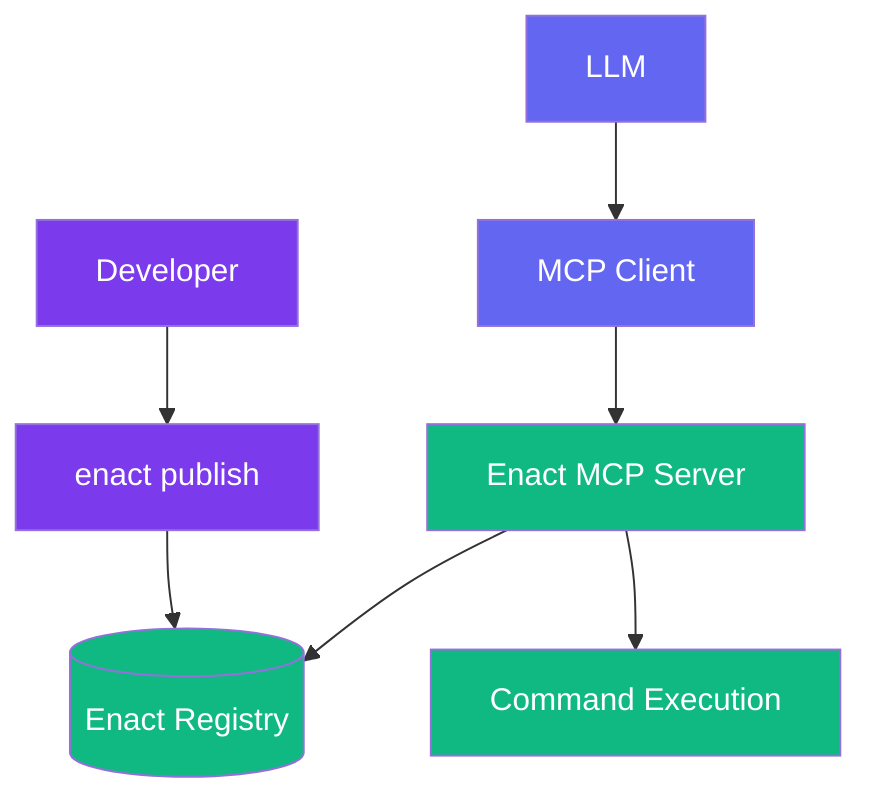

# Enact Protocol

  [](https://discord.gg/mMfxvMtHyS)

## What is Enact?

**Enact** revolutionizes how AI tools are defined, packaged, and shared.

Enact is a protocol that complements the [Model Context Protocol (MCP)](https://github.com/modelcontextprotocol) by providing a standardized way to define, package, discover, and secure AI tools.

While MCP enables communication between AI models and tools, **Enact handles the complete lifecycle of those tools**—ensuring they are:

* 🌐 **Discoverable** — semantically searchable across registries
* 📦 **Packaged** — defined in a consistent, executable format
* 🔐 **Secure** — protected with cryptographic signatures and verification
* 🕒 **Reproducible** — versioned with content pinning for reliability

> **Enact provides the standards for packaging, securing, and discovering tools**

---

## 🚀 Quick Start

### Your First Tool (3 lines!)

```yaml
name: HelloWorld
description: "Greets the world"
command: "echo 'Hello, ${name}!'"
```

That's it! This tool can now be published, discovered, and used by any AI model.

### A More Complete Example

```yaml
name: WordCounter
description: "Counts words in text"
command: "npx github:wordtools/counter#e5f7a9c2d --text='${text}' --format='${format}'"
timeout: "30s"

# Input validation (JSON Schema)
inputSchema:
  type: object
  properties:
    text:
      type: string
      description: "Text to analyze"
    format:
      type: string
      enum: ["json", "plain"]
      default: "json"
  required: ["text"]

# Test cases
examples:
  - input: {text: "hello world", format: "json"}
    output: '{"words": 2, "characters": 11}'
```

---

## 🧱 Core Concepts

### Field Requirements

Enact uses a three-tier approach to field requirements:

```yaml
# REQUIRED (minimum viable tool)
name: string         # Tool identifier
description: string  # What the tool does  
command: string      # Shell command to execute

# RECOMMENDED (production best practices)
timeout: string      # Execution timeout (Go duration format)
tags: [string]       # Search and categorization tags

# OPTIONAL (advanced features)
namespace: string    # Environment variable namespace
inputSchema: object  # JSON Schema for input validation
signature: object    # Cryptographic signature
resources: object    # Resource requirements
```

### Universal Command Execution

Enact's superpower is its **command interface** executed through the Enact MCP Server. Any shell command works with version pinning for reproducibility:

```yaml
# NPX with GitHub commit hashes (secure, immutable)
command: "npx github:org/tool#abc123def --input='${data}'"
command: "npx github:org/tool#f9e2b8d6a --input='${data}'"

# Docker with specific tags/digests  
command: "docker run --rm my-tool:v1.0 '${input}'"
command: "docker run --rm my-tool@sha256:abc123... '${input}'"

# HTTP APIs with version in URL
command: "curl -s 'https://api.example.com/v1/process' -d '${json}'"

# Shell pipelines
command: "cat '${file}' | grep '${pattern}' | wc -l"

# Complex workflows with pinned tools
command: |
  echo "Processing ${input}" &&
  npx github:org/validator#d7c9f2e8a &&
  npx github:org/transformer#b8a5d3c1f --data='${input}' > output.json
```

### Progressive Complexity

Start simple, add features as needed:

**Level 1: Minimal** (3 required fields)
```yaml
name: MyTool
description: "Does something useful"
command: "npx github:myorg/my-tool#b4a8c2d9f '${input}'"
```

**Level 2: Production-Ready** (+ validation & metadata)
```yaml
name: MyTool
description: "Does something useful"
command: "npx github:myorg/my-tool#b4a8c2d9f '${input}'"
timeout: "30s"
tags: ["utility", "text-processing"]

inputSchema:
  type: object
  properties:
    data:
      type: string
      description: "Input data"
    format:
      type: string
      enum: ["json", "xml"]
  required: ["data"]
```

**Level 3: Enterprise** (+ environment & signatures)
```yaml
name: MyTool
description: "Does something useful"
command: "npx github:myorg/my-tool#abc123def '${input}'"
timeout: "30s"
tags: ["utility", "text-processing"]
namespace: "tools.mycompany.analytics"

env:
  API_KEY:
    description: "API key for service access"
    source: "https://example.com/api → Settings → API Keys"
    required: true

inputSchema:
  type: object
  properties:
    data:
      type: string
      description: "Input data"
  required: ["data"]

signature:
  algorithm: sha256
  signer: developer-id
  type: ecdsa-p256
  created: 2025-05-15T23:55:41.328Z
  value: MEUCICwNLAzYZQAul2/uhPkdjxNrNwkFWy2qYOGV5pWIpdabAiEAlpDsXUiOMKrXgIVZcddn6CoPsseC/3eLCSXEMOScg+M=
```

---

## 🧠 How Enact Extends MCP

MCP defines [tools](https://modelcontextprotocol.io/docs/concepts/tools) with a basic structure, but doesn't address the complete tool lifecycle. Enact fills this gap:

**MCP Tool Definition:**
```json
{
  "name": "string",          // Unique identifier for the tool
  "description": "string",   // Human-readable description (optional)
  "inputSchema": {           // JSON Schema for the tool's parameters
    "type": "object",
    "properties": {}         // Tool-specific parameters
  }
}
```

**Enact builds on this foundation** by adding essential lifecycle management capabilities:

| Capability | MCP | Enact |
|------------|-----|-------|
| Communication Protocol | ✅ Defines interaction | ✅ Uses MCP protocol |
| Tool Execution | ❌ Server implementation required | ✅ Command-based execution via Enact MCP Server |
| Tool Discovery | ❌ | ✅ Semantic search & registry |
| Tool Packaging | ❌ | ✅ Standard YAML schema |
| Versioning & Reproducibility | ❌ | ✅ Version pinning in commands |
| Security & Verification | ❌ | ✅ Cryptographic signatures |
| Environment Management | ❌ | ✅ Namespace isolation |

---

## 📋 Tool Definition Reference

### Required Fields

```yaml
name: string         # Tool identifier (must be unique)
description: string  # Human-readable description of what the tool does
command: string      # Shell command to execute (with version pins recommended)
```

### Recommended Fields

```yaml
timeout: string      # Execution timeout in Go duration format: "30s", "5m", "1h" (default: "30s")
tags: [string]       # Tags for search and categorization
```

### Optional Fields

```yaml
namespace: string    # Environment variable namespace (e.g., "tools.enact.discord")
version: string      # Tool definition version for tracking changes
```

### Input Schema (JSON Schema)

Tools use [JSON Schema](https://json-schema.org/) for input validation:

```yaml
inputSchema:
  type: object
  properties:
    text:
      type: string
      description: "Text to analyze"
    format:
      type: string
      enum: ["json", "plain"]
      default: "json"
    count:
      type: integer
      minimum: 1
      maximum: 100
  required: ["text"]
```

### Tool Behavior Annotations

```yaml
# Behavior hints (all default to false, aligned with MCP)
annotations:
  readOnlyHint: true      # Tool doesn't modify the system
  idempotentHint: true    # Multiple calls produce same result as single call
  destructiveHint: false  # Tool may make permanent/irreversible changes
  openWorldHint: false    # Tool connects to external systems/internet
```

### Environment Variables

Environment variables use detailed object syntax for security and documentation:

```yaml
# Define tool namespace
namespace: "tools.enact.discord"

# Declare required environment variables
env:
  API_KEY:
    description: "Discord bot API key"
    source: "https://discord.com/developers → Create App → Bot → Token"
    required: true
  WEBHOOK_URL:
    description: "Discord webhook for notifications"
    source: "Server Settings → Integrations → Webhooks → Create"
    required: true
  REQUEST_TIMEOUT:
    description: "API request timeout in seconds"
    default: "10"
    required: false
```

**Storage Structure:**
```bash
~/.enact/
└── env/
    └── tools/
        └── enact/
            └── discord/
                ├── .env          # User's actual secrets
                └── .env.example  # Template from tool
```

**Security Model:**
- Each tool execution reads ONLY from its namespace directory
- No access to parent process environment
- Secrets stored in `.env` files (use OS file permissions)
- Simple security model to start, will enhance over time

### Testing & Examples

```yaml
examples:
  - input: {text: "hello world", format: "json"}
    output: {words: 2, characters: 11}
    description: "Basic word counting"
  - input: {text: "one"}
    output: {words: 1}
    description: "Single word test"
```

### Cryptographic Signatures

Tools can be signed for authenticity verification:

```yaml
signature:
  algorithm: sha256
  signer: developer-id
  type: ecdsa-p256
  created: 2025-05-15T23:55:41.328Z
  value: MEUCICwNLAzYZQAul2/uhPkdjxNrNwkFWy2qYOGV5pWIpdabAiEAlpDsXUiOMKrXgIVZcddn6CoPsseC/3eLCSXEMOScg+M=
```

---

## 🏗 Architecture



**Flow:**
1. Developer creates tool definition (YAML)
2. CLI validates and publishes to registry
3. AI models discover tools via semantic search
4. Enact MCP Server fetches and executes tool commands
5. Results return to AI model

---

## 🧪 Example Tools

### Text Analysis
```yaml
name: SentimentAnalyzer
description: "Analyzes sentiment of text"
command: "npx github:texttools/sentiment#v2.1.0 --text='${text}'"
timeout: "30s"
tags: ["text", "analysis", "sentiment", "nlp"]

inputSchema:
  type: object
  properties:
    text:
      type: string
      description: "Text to analyze"
  required: ["text"]

examples:
  - input: {text: "I love this!"}
    output: {sentiment: "positive", score: 0.98}

annotations:
  readOnlyHint: true
  idempotentHint: true
```

### Image Processing
```yaml
name: ImageResizer
description: "Resizes images"
command: "docker run --rm imagetools:v3.2@sha256:abc123... resize --input='${url}' --width='${width}'"
timeout: "2m"
tags: ["image", "resize", "media", "processing"]

inputSchema:
  type: object
  properties:
    url:
      type: string
      format: uri
      description: "Image URL"
    width:
      type: integer
      description: "Target width in pixels"
      minimum: 1
      maximum: 4096
  required: ["url", "width"]

annotations:
  openWorldHint: true
```

### Data Pipeline
```yaml
name: CSVProcessor
description: "Validates and transforms CSV data"
command: |
  enact exec csv-validator --file='${file}' --schema='${schema}' &&
  enact exec csv-transformer --file='${file}' --output=processed.csv
timeout: "5m"
tags: ["data", "csv", "validation", "etl", "pipeline"]

inputSchema:
  type: object
  properties:
    file:
      type: string
      description: "CSV file path"
    schema:
      type: string
      format: uri
      description: "Validation schema URL"
  required: ["file"]
```

### Video Processing
```yaml
name: VideoTranscoder
description: "Transcodes videos using GPU acceleration"
command: "docker run --gpus all video-tools@sha256:d9c8e2f7a... transcode --input='${input}' --output='${output}' --format='${format}'"
timeout: "30m"
tags: ["video", "media", "transcoding", "gpu"]

resources:
  memory: "16Gi"
  gpu: "24Gi"
  disk: "100Gi"

inputSchema:
  type: object
  properties:
    input:
      type: string
      description: "Input video URL"
    output:
      type: string
      description: "Output filename"
    format:
      type: string
      enum: ["mp4", "webm", "mov"]
      default: "mp4"
  required: ["input", "output"]

annotations:
  openWorldHint: true
```

### API Integration
```yaml
name: WeatherFetch
description: "Gets current weather"
command: "curl -s 'https://api.weather.com/v1/current?location=${city}&units=${units}&key=$API_KEY&timeout=${REQUEST_TIMEOUT}'"
timeout: "30s"
tags: ["weather", "api", "external", "location"]
namespace: "tools.enact.weather"

env:
  API_KEY:
    description: "Weather API key for accessing current conditions"
    source: "https://weather.com/developers → Create Account → API Keys"
    required: true
  REQUEST_TIMEOUT:
    description: "API request timeout in seconds"
    default: "10"
    required: false

inputSchema:
  type: object
  properties:
    city:
      type: string
      description: "City name"
    units:
      type: string
      enum: ["metric", "imperial"]
      default: "metric"
      description: "Temperature units"
  required: ["city"]

annotations:
  openWorldHint: true
  idempotentHint: true
```

---

## 🔐 Security

### Version Pinning

Always pin tool versions directly in commands for reproducibility:

```yaml
# NPX with GitHub - use commit hashes (9+ chars recommended)
command: "npx github:org/tool#abc123def"
command: "npx github:org/tool#f9e2b8d6a"

# NPM registry with exact versions can be vulnerable to supply chain attacks and should be avoided.
command: "npx my-tool@1.2.3"

# Docker with tags or digests (digests preferred)
command: "docker run my-tool:v1.0"
command: "docker run my-tool@sha256:abc123..."

# URLs with version in path
command: "curl https://example.com/api/v2/process"
```

### Cryptographic Signatures

Verify tool authenticity with signatures:

```yaml
signature:
  algorithm: sha256
  signer: developer-id
  type: ecdsa-p256
  created: 2025-05-15T23:55:41.328Z
  value: MEUCICwNLAzYZQAul2/uhPkdjxNrNwkFWy2qYOGV5pWIpdabAiEAlpDsXUiOMKrXgIVZcddn6CoPsseC/3eLCSXEMOScg+M=
  role: "author" # role is optional description of the signer.
```

**Signature verification is handled automatically by the Enact MCP Server.**

---

## 🛠 CLI Usage

```bash
# Create a new tool
enact init my-tool

# Validate tool definition
enact validate tool.yaml

# Test locally
enact test tool.yaml --input '{"text": "hello"}'

# Publish to registry
enact publish tool.yaml

# Search for tools
enact search "text analysis"
```

---

## 🌐 MCP Integration

Enact tools are available through the Enact MCP Server:

```javascript
// Search for tools
const tools = await client.call('enact-search-capabilities', {
  query: 'sentiment analysis'
});

// Register a tool
await client.call('enact-register-capability', { 
  id: tools[0].id 
});

// Execute a registered tool
const result = await client.call('execute-capability-by-id', {
  id: tools[0].id,
  args: { text: 'I love this!' }
});
```

---

## 🤝 Why Enact?

**For Developers:**
- Write tools in any language or technology
- Use familiar shell commands
- Test locally before publishing
- Version and sign your tools

**For AI Applications:**
- Discover tools semantically
- Trust verified tools
- Scale seamlessly
- Consistent execution model

**For Enterprises:**
- Control tool approval with signatures
- Audit tool usage and versions
- Ensure reproducibility
- Manage security policies

---

## 📚 Best Practices

### 1. Start Simple
Begin with the minimal 3-field format and add features as needed.

### 2. Use Descriptive Names
- ✅ `PDFToTextConverter`
- ❌ `pdf2txt`

### 3. Pin Dependencies
Always include version pins in your commands for reproducibility.

### 4. Test Your Tools
Include examples to verify behavior and document expected outputs.

### 5. Use Namespaces for Environment Variables
Group related tools and prevent variable conflicts:
- `tools.enact.discord` for Discord tools
- `tools.company.analytics` for company analytics tools
- `tools.personal.utils` for personal utilities

### 6. Document Behavior with Annotations
Use `readOnlyHint`, `idempotentHint`, `destructiveHint`, and `openWorldHint` to help AI models understand tool behavior.

### 7. Set Appropriate Timeouts
Use Go duration format: `"30s"`, `"5m"`, `"1h"`. Match timeout values to expected execution time.

### 8. Use Tags for Better Discovery
Add relevant tags to help users find your tools:
- ✅ `["text", "analysis", "sentiment"]` for sentiment analysis
- ✅ `["image", "resize", "media"]` for image processing
- ✅ `["data", "csv", "validation"]` for data tools

---

## 📋 Complete Field Reference

### Core Fields

```yaml
# REQUIRED FIELDS
name: string         # Tool identifier (required)
description: string  # Human-readable description (required)
command: string      # Shell command to execute with version pins (required)

# RECOMMENDED FIELDS
timeout: string      # Go duration format: "30s", "5m", "1h" (default: "30s")
tags: [string]       # Tags for search and categorization

# OPTIONAL FIELDS
namespace: string    # Environment variable namespace
version: string      # Tool definition version for tracking changes
resources:           # Resource requirements
  memory: string     # System memory needed (e.g., "16Gi", "32Gi")
  gpu: string        # GPU memory needed (e.g., "24Gi", "48Gi")
  disk: string       # Disk space needed (e.g., "100Gi", "500Gi")
```

### Environment Variables

```yaml
env:
  VARIABLE_NAME:
    description: string  # What this variable is for (required)
    source: string       # Where to get this value (required)
    required: boolean    # Whether this is required (required)
    default: string      # Default value if not set (optional)
```

### Schema Definitions

```yaml
inputSchema: object  # Input parameters as JSON Schema
outputSchema: object # Output structure as JSON Schema (optional)
```

### Documentation and Testing

```yaml
doc: string          # Markdown documentation (optional)
authors:             # Tool creators (optional)
  - name: string     # Author name (required)
    email: string    # Author email (optional)
    url: string      # Author website (optional)

examples:            # Test cases and expected outputs
  - input: object    # Input parameters
    output: any      # Expected output
    description: string # Test description (optional)
```

### Behavior Annotations

```yaml
annotations:         # MCP-aligned behavior hints (all default to false)
  title: string              # Human-readable display name (optional)
  readOnlyHint: boolean      # No environment modifications
  destructiveHint: boolean   # May make irreversible changes
  idempotentHint: boolean    # Multiple calls = single call
  openWorldHint: boolean     # Interacts with external systems
```

### Security

```yaml
signature:           # Cryptographic signature (optional)
  algorithm: string  # Hash algorithm: "sha256" (required)
  type: string       # Signature type: "ecdsa-p256" (required)
  signer: string     # Signer identifier (required)
  created: string    # ISO timestamp (required)
  value: string      # Base64 encoded signature (required)
```

### Extensions

```yaml
x-*: any             # Custom extensions (must begin with 'x-')
```

---

## 🚧 Roadmap

**Current (Alpha)**
- ✅ Core protocol specification
- ✅ Command-based execution
- ✅ Basic MCP integration via Enact MCP Server
- 🔄 Signature verification implementation

**Next (Beta)**
- 🔄 Enhanced CLI with testing
- 🔄 Public registry launch
- 🔄 Advanced security features
- 🔄 Performance optimizations

**Future**
- ⏳ Visual tool builder
- ⏳ Marketplace features
- ⏳ Enhanced environment security
- ⏳ Multi-language execution environments

---

## 💬 Community

Join our growing community:

- 💬 [Discord](https://discord.gg/mMfxvMtHyS) - Chat with developers
- 🐛 [GitHub Issues](https://github.com/EnactProtocol/enact) - Report bugs
- 📖 [Documentation](https://docs.enact.tools) - Full reference
- 🌟 [Registry](https://enact.tools) - Browse tools

---

## 📄 License

MIT License - see [LICENSE](LICENSE) for details.

© 2025 Enact Protocol Contributors

---

*"Perfection is achieved not when there is nothing more to add, but when there is nothing left to take away."* — Antoine de Saint-Exupéry
