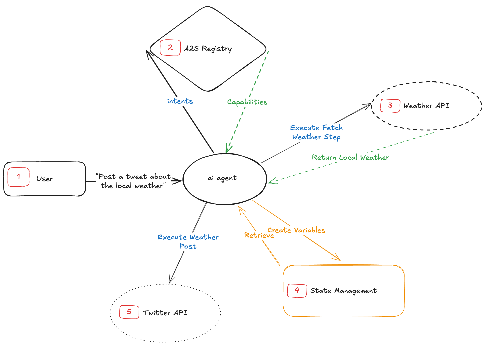

# Enact Protocol (Enact)

  [](https://discord.gg/mMfxvMtHyS)

The **Enact Protocol (Enact)** provides a standardized framework for defining and executing automated tasks and workflows. It enables the creation of reusable, composable, and verifiable capabilities that can be discovered and executed in a structured, auditable environment.

## Overview

Enact is designed for scenarios where you need to define, share, and execute automated workflows in a standardized way. By providing a clear schema for capabilities, parameters, tasks, and flow controls, Enact ensures consistency and interoperability across different implementations.

**Example Scenario:**

```yaml
enact: 1.0.0
id: GetStockPrice
description: Retrieves the current stock price for a given ticker symbol.
version: 1.0.0
type: atomic
authors:
  - name: Jane Doe
inputs:
  ticker: 
    type: string
    description: The stock ticker symbol (e.g., AAPL)
tasks:
  - id: fetchPrice
    type: script
    language: python
    code: |
      # Task implementation
flow:
  steps:
    - task: fetchPrice
outputs:
  price: 
    type: number
    format: float
    description: The current stock price
```

## Core Features

- **Composability:** Build complex workflows from simple atomic capabilities
- **Version Control:** Built-in versioning for capabilities and their dependencies
- **Task Orchestration:** Structured flow control for executing multiple tasks
- **Input/Output Contracts:** Clear definitions of data requirements and produced results

## Core Concepts

### Capabilities

A **capability** is a unit of functionality defined in YAML that follows the Enact Protocol Schema. It can be either atomic (single operation) or composite (workflow combining multiple capabilities).

**Required Fields:**
```yaml
enact: 1.0.0              # Protocol version
id: string                # Unique identifier
description: string       # What the capability does
version: 1.0.0           # Capability version
type: atomic|composite    # Capability type
authors:                  # List of authors
  - name: string
inputs: object           # Input parameters
tasks: array             # Task definitions
flow: object            # Execution flow
outputs: object         # Output parameters
```

### Capability Types

**Atomic Capabilities**
- Single, self-contained operation
- No dependencies on other capabilities
- Example: Making an API call, executing a script

**Composite Capabilities**
- Combines multiple atomic capabilities
- Defines workflow between capabilities
- Example: Multi-step data processing pipeline

### Tasks

Tasks represent the executable units within a capability. Each task must have:

```yaml
tasks:
  - id: uniqueId           # Task identifier
    type: string          # Task type (script, request, etc.)
    language: string      # For script tasks
    code: string         # Implementation
```



### Task Types

- `script`: Execute code in specified language

**Additional types can be defined as needed**
- `request`: Make HTTP/API calls
- `prompt`: feeds a prompt to the agent

### Flow Control

The flow section defines how tasks are executed:

```yaml
flow:
  steps:
    - task: taskId        # Reference to task
```

### Parameter Management

**Input Parameters:**
```yaml
inputs:
  paramName:
    type: string         # Data type
    description: string  # Parameter description
    format: string      # Optional format specifier
    default: any        # Optional default value
```

**Output Parameters:**
```yaml
outputs:
  paramName:
    type: string         # Data type
    description: string  # Parameter description
    format: string      # Optional format specifier
```

## Best Practices

1. **Atomic Capability Design**
   - Keep capabilities focused on single responsibility
   - Make inputs and outputs explicit
   - Include proper error handling

2. **Composite Capability Design**
   - Define clear dependencies
   - Handle task failures gracefully
   - Document the workflow clearly

## License

This project is licensed under the [MIT License](LICENSE).