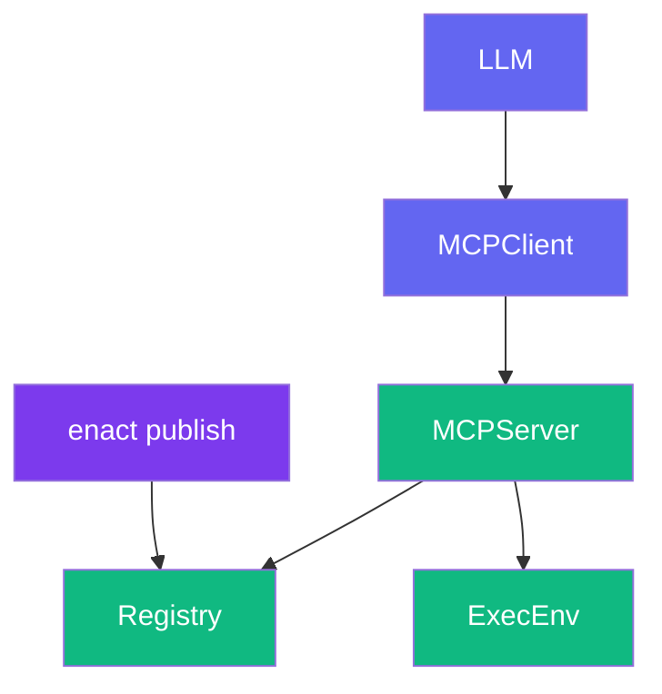
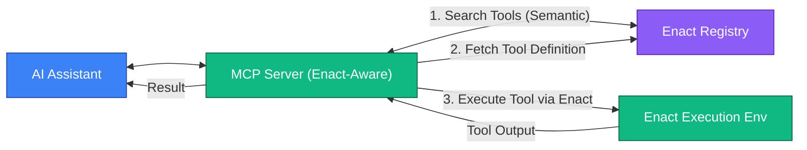

# Enact Protocol

  [](https://discord.gg/mMfxvMtHyS)

## What is Enact?

**Enact** is a protocol that complements the [Model Context Protocol (MCP)](https://github.com/modelcontextprotocol) by providing a standardized way to define, package, discover, secure, and execute AI tools.

Where MCP enables communication between AI models and tools, **Enact handles the lifecycle of those tools**—making sure they are:

* 🌐 **Discoverable** — semantically searchable
* 📦 **Packaged** — defined in a consistent and executable format
* 🔐 **Secure** — with cryptographic signatures and sandboxing
* 🕒 **Reproducible** — thanks to versioning and commit pinning
* ⚙️ **Configurable** — through standardized environment definitions

> Think of Enact as the registry, runtime, and security layer for MCP tools.

---

## 🧠 How Enact Complements MCP

While MCP focuses on tool **communication**, Enact focuses on tool **management**:

| Capability                   | MCP                   | Enact                     |
| ---------------------------- | --------------------- | ------------------------- |
| Communication Protocol       | ✅ Defines interaction | ❌                         |
| Tool Discovery               | ❌                     | ✅ Semantic search         |
| Tool Packaging               | ❌                     | ✅ Standard YAML schema    |
| Versioning & Reproducibility | ❌                     | ✅ Semantic & commit-based |
| Security & Timeouts          | ❌                     | ✅ Signatures, limits      |
| Environment Management       | ❌                     | ✅ Global + tool-level     |

---

## 🧱 Core Concepts

### 🔧 Tool Definition

Enact tools are defined in YAML using a simple schema:

```yaml
enact: 0.0.1
name: WordCounter
description: "Counts words in a given text."
type: npx
source: word-counter-tool
version: "1.2.0"
inputSchema:
  type: object
  properties:
    text:
      type: string
      description: "Text to analyze"
  required: ["text"]
config:
  args: ["--text={{text}}"]
```

Additional optional fields:

* `outputSchema`: Define result types and structure
* `commit`: Pin to specific Git commit
* `timeout`: Max execution time
* `signature`: Signed manifest
* `annotations`: Hints for AI usage

### 🛠 Tool Types

| Type            | Description                             |
| --------------- | --------------------------------------- |
| `npx`           | Executes via npm-compatible CLI         |
| `mcp`           | Wraps another MCP tool (proxy or alias) |
| `uvx` / `cargo` | Other custom runners (TBD)              |

---

## 🏗 Architecture Overview



* **Enact CLI**: Used by developers to publish tools
(github repo coming soon)

* **Registry**: Stores and indexes tools
example: https://enact.tools

* **MCP Server (Enact-aware)**: Orchestrates discovery and execution

---

## 🧪 Tool Examples

### Example: NPX Tool

**NPX Tool Example:**
```yaml
enact: 0.0.1
name: WordCounter
description: "Count words in text"
type: npx
source: word-counter-tool # example npm package
version: "1.2.0"
commit: "abc123def456789" # Optional specific commit hash from its repository
inputSchema:
  type: object
  properties:
    text:
      type: string
  required: ["text"]
config:
  args: ["--text={{text}}"] # Templated argument
  timeout: 30000           # 30 seconds timeout
annotations:
  title: "Word Counter"
  readOnlyHint: true
  idempotentHint: true```
```
### Example: MCP Tool

```yaml
enact: 0.0.1
name: McpEchoViaEnact
description: "Echo a message using an existing MCP tool on another server, managed by Enact"
type: "mcp"
source: "@modelcontextprotocol/server-everything" # Identifier for the target MCP server/service
version: "0.1.0" # Version of this Enact definition for calling the MCP tool
inputSchema:
  type: object
  properties:
    message:
      type: string
      description: "Message to echo back"
  required: ["message"]
config:
  tool: "echoOnRemoteServer" # The specific tool name on the source MCP server

```

**MCP Tool Example (Advanced):**
```yaml
enact: 0.0.1
name: BraveSearch
description: "Search the web using Brave Search API"
type: "mcp"
source: "@modelcontextprotocol/server-brave-search" # Identifier for the target MCP server/service
version: "1.0.0"
inputSchema:
  type: object
  properties:
    query:
      type: string
      description: "Search query"
  required: ["query"]
config:
  command: "npx"
  args: ["-y", "@modelcontextprotocol/server-brave-search"]
  env:
    BRAVE_API_KEY: "<PUT YOUR BRAVE API KEY>"
  timeout: 10000 # 10 seconds timeout
annotations:
  title: "Brave Search"
  readOnlyHint: true
  openWorldHint: true
```

---

## 📚 Schema Highlights

### Input & Output Parameters

Defined using [JSON Schema](https://json-schema.org/), enabling validation, documentation, and tooling support.

```yaml
inputSchema:
  type: object
  properties:
    paramName:
      type: string      # Data type (string, number, boolean, object, array)
      description: string # Parameter description
      format: string      # Optional format specifier (e.g., "date-time", "email")
      default: any        # Optional default value
      # Any other JSON Schema validation keywords
  required: ["paramName"] # Array of required parameter names
```

A recommended pattern for `outputSchema` to handle both successful results and errors:

```yaml
outputSchema:
  type: object
  properties:
    result:
      type: object # Or any other type representing the successful output
      description: "The successful operation result"
    error:
      type: object
      properties:
        message:
          type: string
        code:
          type: string # Or number
      required: ["message"]
      description: "Error information if the operation failed"
  oneOf: # Ensures that either result or error is present, but not both
    - required: ["result"]
    - required: ["error"]
```

---

## 🔐 Security Features

### ✅ Commit Pinning

Ensure reproducibility by pinning a tool to a specific Git commit:

```yaml
commit: "abc123def456"
```

### ✅ Timeouts

Prevent runaway executions:

```yaml
config:
  timeout: 30000 # 30 seconds
```

### ✅ Cryptographic Signatures

Verify tool authenticity:

```yaml
signature:
  value: "MEUCI..."
  signer: "registry-id"
```

---

## 🌍 Environment Management

### Tool-specific

```yaml
config:
  env:
    API_KEY: "{{api_key}}"
```

### Global (per machine)

```yaml
# ~/.enact/env.yaml
"word-counter-tool":
  DEFAULT_LANGUAGE: "en"
```

---

## 🤖 MCP Integration

### Dynamic Discovery

AI agents can discover tools using semantic search via tools like `enact-search-tools`.

### Direct Execution

Execute by tool name via `execute-capability-by-name`.




---

## 🎯 Why Use Enact?

✅ **Standardization** — Tools are defined consistently
🔍 **Discoverability** — Semantic search for capabilities
🔐 **Security** — Signatures, sandboxing, commit pinning
📦 **Packaging** — Versioning and lifecycle control
🌐 **Portability** — Works across platforms and runtimes
⚙️ **Dev Tooling** — Easy to publish, manage, and integrate

---

## 🤝 Contributing

We welcome feedback, tools, and protocol extensions!

* Join us on [Discord](https://discord.gg/mMfxvMtHyS)
* Submit PRs or Issues on GitHub
* Publish tools with:

  ```bash
  enact publish .
  ```

> "Perfection is achieved not when there is nothing more to add, but when there is nothing left to take away."
>
> — *Antoine de Saint-Exupéry*

## License

This project is licensed under the [MIT License](LICENSE).

---

© 2025 Enact Protocol Contributors