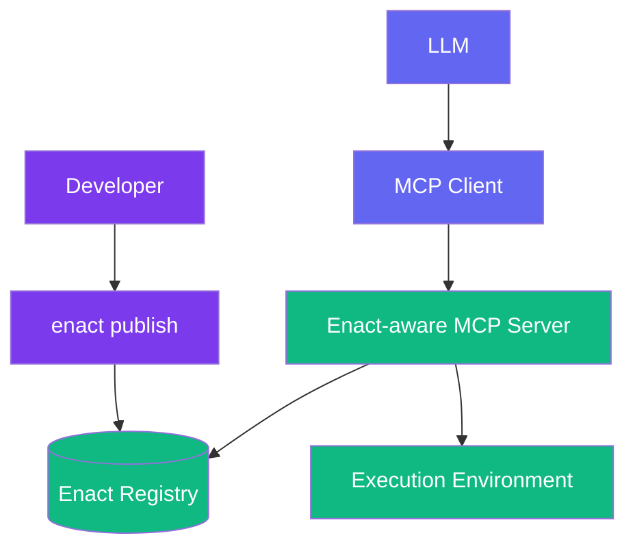

# Enact Protocol

  [](https://discord.gg/mMfxvMtHyS)

## What is Enact?

**Enact** revolutionizes how AI tools are defined, packaged, and shared.

Enact is a protocol that complements the [Model Context Protocol (MCP)](https://github.com/modelcontextprotocol) by providing a standardized way to define, package, discover, and secure AI tools.

While MCP enables communication between AI models and tools, **Enact handles the complete lifecycle of those tools**—ensuring they are:

* 🌐 **Discoverable** — semantically searchable across registries
* 📦 **Packaged** — defined in a consistent, executable format
* 🔐 **Secure** — protected with cryptographic signatures and hash verification
* 🕒 **Reproducible** — versioned with hash pinning for reliability

> **Enact provides the standards for packaging, securing, and discovering tools**

---

## 🧠 How Enact Extends MCP

MCP defines [tools](https://modelcontextprotocol.io/docs/concepts/tools) with a basic structure, but doesn't address the complete tool lifecycle. Enact fills this gap:

```yaml
name: string          # Unique identifier for the tool
description: string   # Human-readable description (optional)
inputSchema:
  type: object
  properties: {}      # Tool-specific parameters
annotations:          # Optional hints about tool behavior
  title: string       # Human-readable title for the tool (optional)
  readOnlyHint: boolean       # If true, the tool does not modify its environment
  destructiveHint: boolean    # If true, the tool may perform destructive updates
  idempotentHint: boolean     # If true, repeated calls with same args have no additional effect
  openWorldHint: boolean      # If true, tool interacts with external entities
```

**Enact builds on this foundation** by adding essential lifecycle management capabilities that MCP doesn't address:

| Capability                   | MCP                   | Enact                     |
| ---------------------------- | --------------------- | ------------------------- |
| Communication Protocol       | ✅ Defines interaction | ❌ Uses MCP                |
| Tool Discovery               | ❌                     | ✅ Semantic search         |
| Tool Packaging               | ❌                     | ✅ Standard YAML schema    |
| Versioning & Reproducibility | ❌                     | ✅ Semantic & hash-based   |
| Security & Execution Limits  | ❌                     | ✅ Signatures, timeouts    |

---

## 🧱 Core Concepts

### 🔧 Tool Definition

Enact tools are defined using a simple YAML schema with flexible command execution:

```yaml
name: HelloWorld
description: "A simple Hello World example"
command: "npx hello-world-npx --text={{text}}"
```

For more complex tools, additional fields provide essential functionality:

```yaml
name: WordCounter
description: "Counts words in a given text"
command: "npx word-counter-tool --text={{text}} --format={{format}}"
version: "1.2.0"
hash: "abc123def456789"  # Pin to specific content hash for reproducibility
timeout: 30s
inputSchema:
  type: object
  properties:
    text:
      type: string
      description: "Text to analyze"
    format:
      type: string
      enum: ["json", "plain"]
      default: "json"
  required: ["text"]
```

### 🚀 Universal Command Execution

Enact uses a **flexible command execution model** that supports any command-line operation through standard shell syntax:

- **NPX Packages**: `npx package-name --param={{value}}`
- **Docker Containers**: `docker run --rm image:tag --input={{data}}`
- **HTTP APIs**: `curl -X POST {{api_url}} -d '{{json_body}}'`
- **Shell Pipelines**: `cat {{file}} | grep {{pattern}} | sort | uniq -c`
- **Complex Workflows**: `npx validator {{input}} && npx processor {{input}} {{output}}`

This approach offers several advantages:

- **Zero Learning Curve**: Use familiar shell command syntax
- **Maximum Flexibility**: Any command-line tool or pipeline works immediately
- **Natural Composition**: Shell operators (pipes, redirects, &&) work as expected
- **Easy Migration**: Existing scripts and workflows convert directly

---

## 🏗 Architecture Overview



**Components:**

* **Enact CLI**: Developer tool for publishing and managing tools
* **Registry**: Centralized store for tool definitions (e.g., [enact.tools](https://enact.tools))
* **Enact-aware MCP Server**: Implements the protocol for discovery and execution orchestration
* **Command Execution Engine**: Universal runtime that executes any shell command securely

---

## 🧪 Tool Examples

### Basic NPX Tool

```yaml
name: WordCounter
description: "Count words in text"
command: "npx word-counter-tool --text={{text}}"
version: "1.2.0"
hash: "abc123def456789"  # NPM package commit hash
timeout: 30s
inputSchema:
  type: object
  properties:
    text:
      type: string
      description: "Text to analyze"
  required: ["text"]
annotations:
  title: "Word Counter"
  readOnlyHint: true
  idempotentHint: true
```

### Docker Container Tool

```yaml
name: ImageProcessor
description: "Process images using containerized tools"
command: "docker run --rm --read-only image-processor:v1.0 --input={{imageUrl}} --filter={{filter}}"
hash: "sha256:abc123def456..."  # Docker image digest
timeout: 2m
inputSchema:
  type: object
  properties:
    imageUrl:
      type: string
      format: "uri"
      description: "URL of image to process"
    filter:
      type: string
      enum: ["blur", "sharpen", "vintage"]
      default: "sharpen"
  required: ["imageUrl"]
```

### HTTP API Tool

```yaml
name: WeatherLookup
description: "Get current weather for a location"
command: "curl -s 'https://api.weather.com/v1/current?location={{location}}&units={{units}}&key=$WEATHER_API_KEY'"
hash: "sha256:endpoint-integrity-hash"
timeout: 15s
env: ["WEATHER_API_KEY"]
inputSchema:
  type: object
  properties:
    location:
      type: string
      description: "City name or coordinates"
    units:
      type: string
      enum: ["metric", "imperial"]
      default: "metric"
  required: ["location"]
```

### Shell Pipeline Tool

```yaml
name: LogAnalyzer
description: "Analyze log files for patterns"
command: "cat {{log_file}} | grep {{pattern}} | sort | uniq -c | sort -nr | head -{{limit}}"
hash: "sha256:script-content-hash"
timeout: 60s
inputSchema:
  type: object
  properties:
    log_file:
      type: string
      description: "Path to log file"
    pattern:
      type: string
      description: "Pattern to search for"
    limit:
      type: integer
      description: "Number of top results to return"
      default: 10
  required: ["log_file", "pattern"]
```

### MCP Tool Integration

```yaml
name: DatabaseQuery
description: "Execute SQL queries via MCP"
command: "mcp-cli cmd --server={{server}} --tool=read_query --tool-args='{{json_args}}' --raw"
hash: "sha256:mcp-cli-hash"
timeout: 45s
inputSchema:
  type: object
  properties:
    server:
      type: string
      description: "MCP server name"
      default: "sqlite"
    query:
      type: string
      description: "SQL query to execute"
  required: ["query"]
```

### Inline Code Execution

```yaml
name: JavaScriptEval
description: "Execute JavaScript code safely"
command: "docker run --rm --read-only --network=none node:18-alpine node -e '{{code}}'"
hash: "sha256:node-image-digest..."
timeout: 30s
security:
  level: "production"
inputSchema:
  type: object
  properties:
    code:
      type: string
      description: "JavaScript code to execute"
      maxLength: 1000
  required: ["code"]
```

### Complex Workflow Tool

```yaml
name: DataPipeline
description: "Multi-step data processing workflow"
command: |
  echo "Starting pipeline for {{dataset}}" &&
  npx data-validator --input={{dataset}} --schema={{schema}} &&
  npx data-transformer --input={{dataset}} --config={{config}} --output=/tmp/processed.json &&
  npx data-uploader --file=/tmp/processed.json --destination={{destination}} &&
  echo "Pipeline completed successfully"
hash: "sha256:workflow-hash"
timeout: 10m
signatures:
  - signer: "pipeline-team@company.com"
    role: "author"
    created: "2025-01-15T10:00:00.000Z"
    value: "MEUCIDWjMXPWhFS..."
inputSchema:
  type: object
  properties:
    dataset:
      type: string
      description: "Input dataset URL"
    schema:
      type: string
      description: "Validation schema URL"
    config:
      type: object
      description: "Transformation configuration"
    destination:
      type: string
      description: "Output destination"
  required: ["dataset", "destination"]
```

---

## 📚 Schema Reference

### Core Fields

```yaml
# Required fields
name: string         # Tool identifier (required)
description: string  # Human-readable description (required)
command: string      # Shell command to execute (required)

# Security and verification
hash: string         # Content/package/image hash for verification
version: string      # Version identifier (optional)

# Execution control
timeout: string      # Human-readable timeout (e.g., "30s", "5m", "1h")
env: [string]        # Required environment variables

# Schema definitions
inputSchema: object  # Input parameters as JSON Schema
outputSchema: object # Output structure as JSON Schema
```

### Input/Output Schemas

Enact uses [JSON Schema](https://json-schema.org/) for parameter definition and validation:

```yaml
inputSchema:
  type: object
  properties:
    paramName:
      type: string
      description: "Parameter description"
      format: "email"           # Optional format validation
      default: "defaultValue"   # Optional default
  required: ["paramName"]
```

**Recommended output schema pattern** for consistent error handling:

```yaml
outputSchema:
  type: object
  properties:
    result:
      type: object
      description: "Successful operation result"
    error:
      type: object
      properties:
        message:
          type: string
        code:
          type: string
      required: ["message"]
      description: "Error information if operation failed"
  oneOf:
    - required: ["result"]
    - required: ["error"]
```

### Template Variables

Commands support template variable substitution:

```yaml
# Basic variable substitution
command: "npx tool --param={{value}} --count={{number}}"

# JSON encoding for complex data  
command: "curl -X POST {{api_url}} -d '{{json_args}}'"

# Environment variable access
command: "npx tool --api-key=$API_KEY --input={{data}}"

# Multi-line commands with variables
command: |
  echo "Processing {{filename}}" &&
  cat {{filename}} | grep {{pattern}} > {{output_file}} &&
  echo "Found $(wc -l < {{output_file}}) matches"
```

### Hash Verification

Hash verification ensures tool integrity and can verify different types of content:

```yaml
# NPX tools: Git commit hash
command: "npx @company/tool --input={{data}}"
hash: "abc123def456789"  # Commit hash from package repository

# Docker tools: Image digest
command: "docker run --rm my-tool:v1.0 --input={{data}}"
hash: "sha256:abc123def456..."  # Docker image digest

# Shell scripts: Content hash
command: "bash -c 'echo processing {{input}}'"
hash: "sha256:script-content-hash"  # SHA256 of command content

# HTTP APIs: Endpoint integrity
command: "curl -X GET {{api_endpoint}}"
hash: "sha256:endpoint-hash"  # Expected response or endpoint verification
```

---

## 🔐 Security Features

### Hash-Based Verification

Ensure tool integrity with content-appropriate hashing:

```yaml
hash: "abc123def456"        # Git commit hash for NPX packages
hash: "sha256:abc123..."    # Docker image digest  
hash: "sha256:content-hash" # Content hash for scripts
```

### Execution Timeouts

Prevent runaway executions with human-readable timeouts:

```yaml
timeout: 30s    # 30 seconds
timeout: 5m     # 5 minutes  
timeout: 1h     # 1 hour
```

### Smart Security Detection

Enact automatically detects security-sensitive patterns and applies appropriate protections:

```yaml
# Automatically containerized for safety
command: "node -e '{{user_code}}'"  # Inline code execution

# Enhanced security for Docker commands
command: "docker run my-tool {{input}}"  # Auto-adds security flags

# Environment variable protection  
command: "curl -H 'Authorization: Bearer $API_TOKEN' {{url}}"  # Secure env handling
```

### Flexible Trust Models

Different signature requirements for different environments:

```yaml
# Development: Author signature only
security:
  level: "development"
  required_signatures: ["author"]

# Production: Author + registry verification
security:
  level: "production" 
  required_signatures: ["author", "registry"]

# Enterprise: Full trust chain
security:
  level: "enterprise"
  required_signatures: ["author", "registry", "enterprise"]
```

### Multi-Party Signatures

Verify tool authenticity and integrity with role-based trust chains:

```yaml
signatures:
  - algorithm: "sha256"
    type: "ecdsa-p256"
    signer: "developer@company.com"
    role: "author"
    created: "2025-01-15T10:30:00.000Z"
    value: "MEUCIDWjMXPWhFS/1Ah3yLG4PyKrideWS..."
    
  - algorithm: "sha256"
    type: "ecdsa-p256"
    signer: "enact-registry"
    role: "registry"
    created: "2025-01-15T11:45:00.000Z"
    value: "MEQCIHGmTlcwSxfJL8nTYtBGLpA9dKxI..."
```

**Signature Roles:**
- `author`: Original tool developer
- `registry`: Registry verification and approval
- `enterprise`: Enterprise security team approval
- `deployment`: Server deployment authorization

---

## 🌍 Environment Variables

Define environment variables as a simple list:

```yaml
env: ["API_KEY", "DATABASE_URL", "MAX_RETRIES"]
```

Or with structured configuration:

```yaml
env:
  vars:
    API_KEY:
      description:

  MAX_RETRIES:
  TIMEOUT

Environment variables are automatically passed to the execution environment and can be referenced in commands using standard shell syntax (`$VAR` or `${VAR}`).

---

## 🤖 Enact MCP Implementation

The [Enact MCP server](https://github.com/EnactProtocol/enact-mcp) provides runtime capabilities:

### Dynamic Discovery

AI agents can find tools using semantic search:
- `enact-search-capabilities`: Search for tools by description
- `enact-search-and-register-capabilities`: Search and auto-register tools
- `enact-register-capability`: Register specific tools for use

### Runtime Tool Registration

Tools are dynamically registered as MCP tools, allowing immediate execution without restart.

### Context Management

Switch execution contexts for isolated tool sessions and clean state management.

### Direct Execution

Execute by tool name via `execute-capability-by-id`.

---

## 🎯 Why Choose Enact?

**For Tool Developers:**
- **Zero learning curve** - use familiar shell command syntax
- **Maximum flexibility** - any command-line tool or pipeline works immediately
- **Natural composition** - shell operators and workflows work as expected
- **Easy migration** - existing scripts convert directly to Enact tools

**For AI Application Builders:**
- **Semantic search** simplifies tool integration
- **Consistent execution model** for all command types
- **Version management** ensures reliable deployments
- **Flexible tool ecosystem** supports any technology stack

**For Enterprise:**
- **Multi-party signatures** enable flexible trust models and audit trails
- **Role-based verification** ensures proper approval workflows
- **Hash verification** prevents supply chain attacks
- **Smart security detection** applies appropriate protections automatically
- **Audit trails** track tool usage and versions
- **Reproducible builds** with content pinning

---

## 🚀 Getting Started

### Publishing Your First Tool

1. **Create a tool manifest** (`enact.yaml`):
   ```yaml
   name: MyAwesomeTool
   description: "Does something amazing"
   command: "npx my-awesome-package --input={{data}}"
   ```

2. **Validate and publish**:
   ```bash
   enact validate .
   enact publish .
   ```

3. **Test integration**:
   ```bash
   enact test my-awesome-tool --input '{"data": "test value"}'
   ```

### Using Enact Tools

Connect to an Enact-aware MCP server and start discovering tools:

```javascript
// Search for capabilities
const tools = await client.call('enact-search-capabilities', {
    query: 'text analysis'
});

// Register and execute
await client.call('enact-register-capability', { id: tools[0].id });
const result = await client.call('execute-capability-by-id', {
    id: tools[0].id,
    args: { text: 'Hello, world!' }
});
```

---

## 🤝 Contributing

We welcome contributions from the community!

**Ways to get involved:**
- 🛠 **Build tools** using the Enact protocol
- 📚 **Improve documentation** and examples
- 🐛 **Report issues** and suggest improvements
- 💬 **Join discussions** on [Discord](https://discord.gg/mMfxvMtHyS)

---

## 📋 Roadmap

**Current (Alpha)**
- ✅ Core protocol specification
- ✅ Flexible command execution model
- ✅ Hash-based verification
- ✅ Multi-party signature system
- ✅ Basic MCP server integration

**Next (Beta)**
- 🔄 Enact CLI
- 🔄 Enhanced security detection and enforcement
- 🔄 Registry with automated hash verification
- 🔄 Role-based trust policy enforcement
- 🔄 Performance optimizations for common patterns

**Future**
- ⏳ Auto-hash generation for published tools
- ⏳ Advanced signature workflows and key management
- ⏳ Visual tool composition interface
- ⏳ Advanced security sandboxing
- ⏳ Multi-language execution environments

---

## All Fields Reference

### Core Fields

```yaml
# Required fields
name: string         # Tool identifier (required)
description: string  # Human-readable description (required)
command: string      # Shell command to execute (required)

# Security and verification
enact: 0.0.1         # Protocol version
hash: string         # Content/package/image hash for verification
version: string      # Version identifier (optional)

# Execution control
timeout: string      # Human-readable timeout (e.g., "30s", "5m")
env: [string]        # Required environment variables list
# OR
env:
  vars:              # Environment variables with template support
    description: string # descript the variable and where to get it.
    KEY: string      # Can use templates (e.g., "{{api_key}}")

# Schema definitions
inputSchema: object  # Input parameters as JSON Schema
outputSchema: object # Output structure as JSON Schema
```

### Documentation

```yaml
doc: string          # Markdown documentation
authors:             # Tool creators
  - name: string     # Author name (required)
    email: string    # Author email (optional)
    url: string      # Author website (optional)
```

### Metadata and Security

```yaml
annotations:         # MCP-aligned behavior hints
  title: string      # Human-readable display name
  readOnlyHint: boolean      # No environment modifications
  destructiveHint: boolean   # May make irreversible changes
  idempotentHint: boolean    # Multiple calls = single call
  openWorldHint: boolean     # Interacts with external systems

security:            # Security configuration
  level: string      # "development", "production", "enterprise"
  required_signatures: [string]  # Required signature roles
  verified: boolean  # Registry verification status
  audited: string    # Audit date

signatures:          # Array of signatures (optional)
  - algorithm: string # Hash algorithm (e.g., "sha256")
    type: string     # Signature algorithm (e.g., "ecdsa-p256")
    signer: string   # Signer identifier (email, server name, etc.)
    role: string     # Signature role (author, registry, enterprise, deployment)
    keyId: string    # Optional key identifier for rotation (optional)
    created: string  # ISO timestamp of signature creation
    expires: string  # Optional expiration timestamp (optional)
    value: string    # Cryptographic signature value (required)
```

### Extensions

```yaml
x-*: any             # Custom extensions (must begin with 'x-')
```

---

*"Perfection is achieved not when there is nothing more to add, but when there is nothing left to take away."*

 — *Antoine de Saint-Exupéry*

--

## 📄 License

This project is licensed under the [MIT License](LICENSE).

© 2025 Enact Protocol Contributors