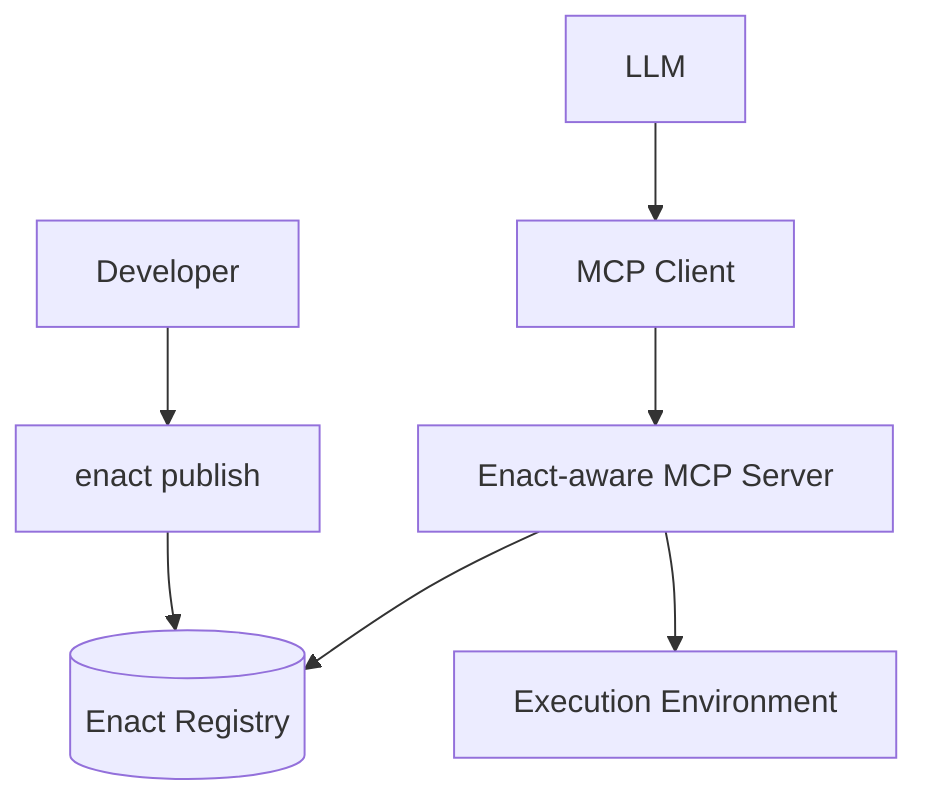

# Enact Protocol

  [](https://discord.gg/mMfxvMtHyS)

## What is Enact?

**Enact** revolutionizes how AI tools are defined, packaged, and shared.

Enact is a protocol that complements the [Model Context Protocol (MCP)](https://github.com/modelcontextprotocol) by providing a standardized way to define, package, discover, and secure AI tools.

While MCP enables communication between AI models and tools, **Enact handles the complete lifecycle of those tools**—ensuring they are:

* 🌐 **Discoverable** — semantically searchable across registries
* 📦 **Packaged** — defined in a consistent, executable format
* 🔐 **Secure** — protected with cryptographic signatures and verification
* 🕒 **Reproducible** — versioned with content pinning for reliability

> **Enact provides the standards for packaging, securing, and discovering tools**

---

## 🚀 Quick Start

### Your First Tool (3 lines!)

```yaml
name: HelloWorld
description: "Greets the world"
command: "echo 'Hello, {{name}}!'"
```

That's it! This tool can now be published, discovered, and used by any AI model.

### A More Complete Example

```yaml
name: WordCounter
description: "Counts words in text"
command: "npx github:wordtools/counter#v1.2.3 --text='${text}' --format=${format}"
timeout: 30s  # Optional, defaults to 30s

# Input validation
inputSchema:
  type: object
  properties:
    text:
      type: string
      description: "Text to analyze"
    format:
      type: string
      enum: ["json", "plain"]
      default: "json"
  required: ["text"]

# Test cases
examples:
  - input: {text: "hello world", format: "json"}
    output: '{"words": 2, "characters": 11}'
```

---

## 🧱 Core Concepts

### Universal Command Execution

Enact's superpower is its **universal command interface**. Any shell command works:

```yaml
# NPX with pinned versions
command: "npx github:org/tool#v1.2.3 --input='${data}'"
command: "npx github:org/tool#abc123def --input='${data}'"

# Docker with specific tags/digests
command: "docker run --rm my-tool:v1.0 '${input}'"
command: "docker run --rm my-tool@sha256:abc123... '${input}'"

# HTTP APIs (version in URL)
command: "curl -s 'https://api.example.com/v1/process' -d '${json}'"

# Shell pipelines
command: "cat ${file} | grep ${pattern} | wc -l"

# Complex workflows with pinned tools
command: |
  echo "Processing ${input}" &&
  npx github:org/validator#v2.1.0 --data='${input}' &&
  npx github:org/transformer#v1.5.2 --data='${input}' > output.json
```

### Progressive Complexity

Start simple, add features as needed:

**Level 1: Basic** (3 lines)
```yaml
name: MyTool
description: "Does something useful"
command: "npx my-tool '${input}'"
```

**Level 2: Standard** (+ validation & testing)
```yaml
name: MyTool
description: "Does something useful"
command: "npx github:myorg/my-tool#v1.2.3 '${input}'"
inputSchema:
  type: object
  properties:
    data:
      type: string
      description: "Input data"
    format:
      type: string
      enum: ["json", "xml"]
  required: ["data"]
```

**Level 3: Advanced** (+ signatures & composition)
```yaml
name: MyTool
description: "Does something useful"
command: "npx github:myorg/my-tool#abc123def '${input}'"
signatures:
  author: "MEUCIDWjMXPWhFS..."
  registry: "MEQCIHGmTlcwSxf..."
```

---

## 📋 Tool Definition Reference

### Essential Fields

```yaml
# Required
name: string         # Tool identifier
description: string  # What it does
command: string      # Shell command to execute (include version pins here)

# Recommended
namespace: string    # Environment variable namespace (e.g., "tools.enact.discord")
timeout: duration    # Default: 30s (e.g., "5m", "1h")
```

### Input Schema

Tools use [JSON Schema](https://json-schema.org/) for input validation:

```yaml
inputSchema:
  type: object
  properties:
    text:
      type: string
      description: "Text to analyze"
    format:
      type: string
      enum: ["json", "plain"]
      default: "json"
    count:
      type: integer
      minimum: 1
      maximum: 100
  required: ["text"]
```

### Tool Behavior

```yaml
# Behavior hints (all default to false)
readOnly: true      # Doesn't modify system
idempotent: true    # Safe to retry
destructive: false  # Makes permanent changes
openWorld: false    # Connects to internet
```

### Environment Variables

Environment variables are scoped by namespace with filesystem isolation:

```yaml
# Define tool namespace
namespace: "tools.enact.discord"

# Declare required environment variables
env:
  API_KEY: "Your Discord API key from discord.com/developers"
  WEBHOOK_URL: "Discord webhook URL for notifications"
```

**Storage Structure:**
```bash
~/.enact/
└── env/
    └── tools/
        └── enact/
            └── discord/
                ├── .env          # User's actual secrets
                └── .env.example  # Template from tool
```

**Security Model:**
- Each tool execution reads ONLY from its namespace directory
- No access to parent process environment
- Secrets are stored in plain `.env` files (use OS file permissions for security)
- For additional security, use OS keychain or encrypted disk

**Example Usage:**
```yaml
name: DiscordNotifier
namespace: "tools.enact.discord"
description: "Send notifications to Discord"
command: "npx github:enact/discord-notify#v1.2.0 --key=$API_KEY --webhook=$WEBHOOK_URL --message='${message}'"
env:
  API_KEY: "Get from discord.com/developers → Applications"
  WEBHOOK_URL: "From Server Settings → Integrations → Webhooks"
inputSchema:
  type: object
  properties:
    message:
      type: string
      description: "Message to send"
  required: ["message"]
```

**Execution:**
```bash
# Runtime loads environment from namespace directory
cd /tmp/enact-execution-$ID
cp ~/.enact/env/tools/enact/discord/.env .
source .env
exec $COMMAND
```

### Testing & Examples

```yaml
examples:
  - input: {text: "hello world"}
    output: {words: 2}
  - input: {text: "one"}
    output: {words: 1}
```

---

## 🏗 Architecture



**Flow:**
1. Developer creates tool definition (YAML)
2. CLI validates and publishes to registry
3. AI models discover tools via semantic search
4. MCP server fetches and executes tools
5. Results return to AI model

---

## 🧪 Example Tools

### Text Analysis
```yaml
name: SentimentAnalyzer
description: "Analyzes sentiment of text"
command: "npx github:texttools/sentiment#v2.1.0 --text='${text}'"
inputSchema:
  type: object
  properties:
    text:
      type: string
      description: "Text to analyze"
  required: ["text"]
examples:
  - input: {text: "I love this!"}
    output: {sentiment: "positive", score: 0.98}
```

### Image Processing
```yaml
name: ImageResizer
description: "Resizes images"
command: "docker run --rm imagetools:v3.2@sha256:abc123... resize --input='${url}' --width=${width}"
inputSchema:
  type: object
  properties:
    url:
      type: string
      format: uri
      description: "Image URL"
    width:
      type: integer
      description: "Target width in pixels"
      minimum: 1
      maximum: 4096
  required: ["url", "width"]
```

### Data Pipeline
```yaml
name: CSVProcessor
description: "Validates and transforms CSV data"
command: |
  npx github:datatools/csv-validator#v1.0.5 --file='${file}' --schema='${schema}' &&
  npx github:datatools/csv-transform#v2.3.1 --file='${file}' --output=processed.csv
timeout: 5m
inputSchema:
  type: object
  properties:
    file:
      type: string
      description: "CSV file path"
    schema:
      type: string
      format: uri
      description: "Validation schema URL"
  required: ["file"]
```

### API Integration
```yaml
name: WeatherFetch
namespace: "tools.enact.weather"
description: "Gets current weather"
command: "curl -s 'https://api.weather.com/v1/current?location=${city}&units=${units}&key=$TOOLS_ENACT_WEATHER_API_KEY'"
openWorld: true
inputSchema:
  type: object
  properties:
    city:
      type: string
      description: "City name"
    units:
      type: string
      enum: ["metric", "imperial"]
      default: "metric"
      description: "Temperature units"
  required: ["city"]
env:
  API_KEY: "Get your API key from weather.com/developers"
```

```

---

## 🔐 Security

### Version Pinning

Pin tools directly in commands for reproducibility:

```yaml
# NPX with GitHub and commits/tags
command: "npx github:org/tool#v1.2.3"
command: "npx github:org/tool#abc123def"

# NPM registry with versions
command: "npx my-tool@1.2.3"

# Docker with tags or digests
command: "docker run my-tool:v1.0"
command: "docker run my-tool@sha256:abc123..."

# URLs with version in path
command: "curl https://example.com/api/v2/process"
```

### Signatures

Verify tool authenticity:

```yaml
signatures:
  author: "MEUCIDWjMXPWhFS..."    # Tool creator
  registry: "MEQCIHGmTlcwSxf..."   # Registry verification
  company: "MEUCIQD9Q3..."        # Additional approval
```

The client/runtime determines appropriate security measures based on the command type and execution environment.

---

## 🛠 CLI Usage

```bash
# Create a new tool
enact init my-tool

# Validate tool definition
enact validate tool.yaml

# Test locally
enact test tool.yaml --input '{"text": "hello"}'

# Publish to registry
enact publish tool.yaml

# Search for tools
enact search "text analysis"
```

---

## 🌐 MCP Integration

Enact tools are automatically available to MCP clients:

```javascript
// Search for tools
const tools = await client.call('enact-search', {
  query: 'sentiment analysis'
});

// Use a tool
const result = await client.call('execute-tool', {
  name: 'SentimentAnalyzer',
  input: { text: 'I love this!' }
});
```

---

## 🤝 Why Enact?

**For Developers:**
- Write tools in any language or technology
- Use familiar shell commands
- Test locally before publishing
- Version and sign your tools

**For AI Applications:**
- Discover tools semantically
- Trust verified tools
- Compose complex workflows
- Scale seamlessly

**For Enterprises:**
- Control tool approval
- Audit tool usage
- Ensure reproducibility
- Manage security policies

---

## 📚 Best Practices

### 1. Start Simple
Begin with the minimal 3-line format and add features as needed.

### 2. Use Descriptive Names
- ✅ `PDFToTextConverter`
- ❌ `pdf2txt`

### 3. Pin Dependencies
Always include version pins in your commands for reproducibility.

### 4. Test Your Tools
Include examples to verify behavior.

### 5. Use Namespaces for Environment Variables
Group related tools and prevent variable conflicts:
- `tools.enact.discord` for Discord tools
- `tools.company.analytics` for company analytics tools
- `tools.personal.utils` for personal utilities

### 6. Document Environment Variables
Always explain where users can obtain required credentials.

---

## 🚧 Roadmap

**Current (Alpha)**
- ✅ Core protocol specification
- ✅ Universal command execution
- ✅ Basic MCP integration

**Next (Beta)**
- 🔄 Tool composition support
- 🔄 Enhanced CLI with testing
- 🔄 Public registry launch
- 🔄 Signature verification

**Future**
- ⏳ Visual tool builder
- ⏳ Marketplace features
- ⏳ Advanced security policies
- ⏳ Performance optimizations

---

## 💬 Community

Join our growing community:

- 💬 [Discord](https://discord.gg/mMfxvMtHyS) - Chat with developers
- 🐛 [GitHub Issues](https://github.com/EnactProtocol/enact) - Report bugs
- 📖 [Documentation](https://docs.enact.tools) - Full reference
- 🌟 [Registry](https://enact.tools) - Browse tools

---

## 📄 License

MIT License - see [LICENSE](LICENSE) for details.

© 2025 Enact Protocol Contributors

---

*"Perfection is achieved not when there is nothing more to add, but when there is nothing left to take away."* — Antoine de Saint-Exupéry