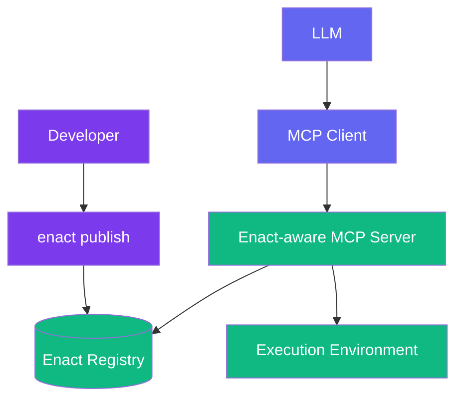

# Enact Protocol

  [](https://discord.gg/mMfxvMtHyS)

## What is Enact?

**Enact** revolutionizes how tools are defined, packaged, and shared.

is a protocol that complements the [Model Context Protocol (MCP)](https://github.com/modelcontextprotocol) by providing a standardized way to define, package, discover, secure, and manage AI tools.

While MCP enables communication between AI models and tools, **Enact handles the complete lifecycle of those tools**—ensuring they are:

* 🌐 **Discoverable** — semantically searchable across registries
* 📦 **Packaged** — defined in a consistent, executable format
* 🔐 **Secure** — protected with cryptographic signatures and sandboxing
* 🕒 **Reproducible** — versioned with commit pinning for reliability
* ⚙️ **Configurable** — managed through standardized environment definitions

> **Enact provides the standards for packaging, securing, and discovering MCP tools**

---

## 🧠 How Enact Extends MCP

MCP defines [tools](https://modelcontextprotocol.io/docs/concepts/tools) with a basic structure:

```yaml
name: string          # Unique identifier for the tool
description: string   # Human-readable description (optional)
inputSchema:
  type: object
  properties: {}      # Tool-specific parameters
annotations:          # Optional hints about tool behavior
  title: string       # Human-readable title for the tool (optional)
  readOnlyHint: boolean       # If true, the tool does not modify its environment
  destructiveHint: boolean    # If true, the tool may perform destructive updates
  idempotentHint: boolean     # If true, repeated calls with same args have no additional effect
  openWorldHint: boolean      # If true, tool interacts with external entities
```

**Enact builds on this foundation** by adding essential lifecycle management capabilities that MCP doesn't address:

| Capability                   | MCP                   | Enact                     |
| ---------------------------- | --------------------- | ------------------------- |
| Communication Protocol       | ✅ Defines interaction | ❌                         |
| Tool Discovery               | ❌                     | ✅ Semantic search         |
| Tool Packaging               | ❌                     | ✅ Standard YAML schema    |
| Versioning & Reproducibility | ❌                     | ✅ Semantic & commit-based |
| Security & Execution Limits  | ❌                     | ✅ Signatures, timeouts    |
| Environment Management       | ❌                     | ✅ Secure, user-friendly   |

---

## 🧱 Core Concepts

### 🔧 Tool Definition

Enact tools are defined using a simple /JSON schema.

```yaml
enact: 0.0.1
name: HelloWorld
description: A simple Hello World example
type: npx
source: hello-world-npx
config:
  args: ["--text={{text}}"]
```

For more complex  tools, additional fields provide essential functionality:

```yaml
enact: 0.0.1
name: WordCounter
description: "Counts words in a given text."
type: npx
source: word-counter-tool
version: "1.2.0"
inputSchema:
  type: object
  properties:
    text:
      type: string
      description: "Text to analyze"
  required: ["text"]
config:
  args: ["--text={{text}}"]
  timeout: 30000
```

### 🛠 Tool Types

Enact supports multiple execution environments:

| Type            | Description                             |
| --------------- | --------------------------------------- |
| `npx`           | Execute npm packages via npx           |
| `mcp`           | Proxy to existing MCP servers          |
| `uvx` / `cargo` | Python/Rust package execution (planned) |
| `js`            | Run simple scripts (more languages coming) |

---

## 🏗 Architecture Overview



**Components:**

* **Enact CLI**: Developer tool for publishing and managing tools
* **Registry**: Centralized store for tool definitions (e.g., [enact.tools](https://enact.tools))
* **Enact-aware MCP Server**: Implements the protocol for discovery and execution orchestration
* **Execution Environment**: Sandboxed runtime where tools actually execute

---

## 🧪 Tool Examples

### NPX Tool

Execute Node.js packages with automatic dependency management:

```yaml
enact: 0.0.1
name: WordCounter
description: "Count words in text"
type: npx
source: word-counter-tool
version: "1.2.0"
commit: "abc123def456789"  # Pin to specific Git commit for reproducibility
inputSchema:
  type: object
  properties:
    text:
      type: string
      description: "Text to analyze"
  required: ["text"]
config:
  args: ["--text={{text}}"]
  timeout: 30000
annotations:
  title: "Word Counter"
  readOnlyHint: true
  idempotentHint: true
```

### MCP Proxy Tool

Wrap existing MCP servers for enhanced management:

```yaml
enact: 0.0.1
name: BraveSearch
description: "Search the web using Brave Search API"
type: mcp
source: "@modelcontextprotocol/server-brave-search"
version: "1.0.0"
inputSchema:
  type: object
  properties:
    query:
      type: string
      description: "Search query"
  required: ["query"]
config:
  command: "npx"
  args: ["-y", "@modelcontextprotocol/server-brave-search"]
  env:
    BRAVE_API_KEY: "{{BRAVE_API_KEY}}"
run:
  timeout: 10000

annotations:
  title: "Brave Search"
  readOnlyHint: true
  openWorldHint: true
```

---

## 📚 Schema Reference

### Input/Output Schemas

Enact uses [JSON Schema](https://json-schema.org/) for parameter definition and validation:

```yaml
inputSchema:
  type: object
  properties:
    paramName:
      type: string
      description: "Parameter description"
      format: "email"           # Optional format validation
      default: "defaultValue"   # Optional default
  required: ["paramName"]
```

**Recommended output schema pattern** for consistent error handling:

```yaml
outputSchema:
  type: object
  properties:
    result:
      type: object
      description: "Successful operation result"
    error:
      type: object
      properties:
        message:
          type: string
        code:
          type: string
      required: ["message"]
      description: "Error information if operation failed"
  oneOf:
    - required: ["result"]
    - required: ["error"]
```

---

## 🔐 Security Features

### Commit Pinning

Lock tools to specific versions for reproducible builds:

```yaml
commit: "abc123def456"
```

### Execution Timeouts

Prevent runaway executions:
```yaml
config:
  timeout: 30000  # 30 seconds maximum execution time
```

### Cryptographic Signatures

Verify tool authenticity and integrity:

```yaml
signature:
  value: "MEUCI..."
  signer: "registry-id"
```

---

## 🌍 Environment Management

### Tool-Specific Configuration

Define environment variables directly in the tool manifest:

```yaml
config:
  env:
    API_KEY: "{{api_key}}"
    MAX_RETRIES: "3"
```

### Global Environment (Planned)

System-wide configuration for common settings:

```yaml
# ~/.enact/env.yaml
"word-counter-tool":
  DEFAULT_LANGUAGE: "en"
  CACHE_ENABLED: "true"
```

---

## 🤖 Enact MCP Implementation

The [Enact MCP server](https://github.com/EnactProtocol/enact-mcp) provides runtime capabilities:

### Dynamic Discovery

AI agents can find tools using semantic search:
- `enact-search-capabilities`: Search for tools by description
- `enact-search-and-register-capabilities`: Search and auto-register tools
- `enact-register-capability`: Register specific tools for use

### Runtime Tool Registration

Tools are dynamically registered as MCP tools, allowing immediate execution without restart.

### Context Management

Switch execution contexts for isolated tool sessions and clean state management.

### Direct Execution

Execute by tool name via `execute-capability-by-name`.

---

## 🎯 Why Choose Enact?

**For Tool Developers:**
- **Standardized packaging** reduces distribution complexity
- **Automated discovery** increases tool adoption
- **Built-in security** protects against misuse

**For AI Application Builders:**
- **Semantic search** simplifies tool integration
- **Version management** ensures reliable deployments
- **Sandboxed execution** provides safe AI tool usage

**For Enterprise:**
- **Cryptographic verification** ensures tool integrity
- **Audit trails** track tool usage and versions
- **Environment isolation** protects sensitive systems

---

## 🚀 Getting Started

### Publishing Your First Tool

1. **Create a tool manifest** (`enact.yaml`):
   ```yaml
   enact: 0.0.1
   name: MyAwesomeTool
   description: "Does something amazing"
   type: npx
   source: my-awesome-package
   ```

2. **Validate and publish**:
   ```bash
   enact validate .
   enact publish .
   ```

3. **Test integration**:
   ```bash
   enact test my-awesome-tool --input '{"param": "value"}'
   ```

### Using Enact Tools

Connect to an Enact-aware MCP server and start discovering tools:

```javascript
// Search for capabilities
const tools = await client.call('enact-search-capabilities', {
    query: 'text analysis'
});

// Register and execute
await client.call('enact-register-capability', { id: tools[0].id });
const result = await client.call('execute-capability-by-id', {
    id: tools[0].id,
    args: { text: 'Hello, world!' }
});
```

---

## 🤝 Contributing

We welcome contributions from the community!

**Ways to get involved:**
- 🛠 **Build tools** using the Enact protocol
- 📚 **Improve documentation** and examples
- 🐛 **Report issues** and suggest improvements
- 💬 **Join discussions** on [Discord](https://discord.gg/mMfxvMtHyS)


## 📋 Roadmap

**Current (Alpha)**
- ✅ Core protocol specification
- ✅ NPX and MCP tool types
- ✅ Basic MCP server implementation

**Next (Beta)**
- 🔄 Enhanced security model
- 🔄 Tool dependency management
- 🔄 Advanced environment configuration
- 🔄 Performance optimizations

**Future**
- ⏳ Additional runtime types (Python, Rust, Go)
- ⏳ Federated registry support
- ⏳ Tool composition and workflows
- ⏳ Enterprise features (RBAC, audit logs)


## All Fields Reference

### Required Fields
```yaml
enact: 0.0.1         # Version of the Enact Protocol schema being used
name: string         # Unique identifier for the tool
description: string  # Human-readable description
type: string         # Execution type (npx, mcp, js)
source: string       # Package name, server URL, or script source
```

### Common Optional Fields
```yaml
version: string      # Semantic version of the tool
commit: string       # Specific commit hash for reproducibility
inputSchema:         # JSON Schema for input validation
  type: object
  properties: {}     # Tool-specific parameters
  required: []       # Required property names
outputSchema:        # JSON Schema for output validation
  type: object
  properties: {}     # Expected output structure
  required: []       # Required output fields
annotations:         # MCP-aligned metadata
  title: string      # Human-readable title
  readOnlyHint: boolean       # If true, does not modify environment
  destructiveHint: boolean    # If true, may perform destructive updates
  idempotentHint: boolean     # If true, repeated calls with same args have same effect
  openWorldHint: boolean      # If true, interacts with external entities
```

### Configuration Fields
```yaml
config:              # Execution configuration
  args: [string]     # Command line arguments with template variables (e.g. ["--text={{text}}"])
  command: string    # Execution command override (e.g., "npx")
  timeout: number    # Maximum execution time in milliseconds
  env:               # Environment variables for the mcp
    ENV_NAME: string # Can use template syntax (e.g. "{{api_key}}")
```

### Security Fields
```yaml
signature:                  # Cryptographic verification
  algorithm: string         # Hashing algorithm used (e.g., "sha256")
  signer: string            # Identifier of the registry or developer
  type: string              # Signature algorithm and curve (e.g., "ecdsa-p256")
  created: string           # ISO timestamp of signature creation
  value: string             # Signature value itself
```
### Environmental Fields
```yaml
  env:                      # For execution environment
    vars:                   # Vars used for this tool (for MCP these can be mapped to MCP vars)
```

### Type-Specific Fields

#### For NPX Tools
```yaml
# Additional NPX-specific fields
config:
  args: [string]     # CLI arguments passed to the NPX package
```

#### For MCP Proxy Tools
```yaml
# Additional MCP-specific fields
config:
  command: string    # Command to start MCP server
  args: [string]     # Arguments to pass to MCP server startup
```

#### For JS Tools
```yaml
run: |
  function main(name = "World") {
    const greeting = `Hello, ${name}!`;
    console.log(greeting);
  }
```


---

## 📄 License

This project is licensed under the [MIT License](LICENSE).

---

*"Perfection is achieved not when there is nothing more to add, but when there is nothing left to take away."*

 — *Antoine de Saint-Exupéry*


© 2025 Enact Protocol Contributors