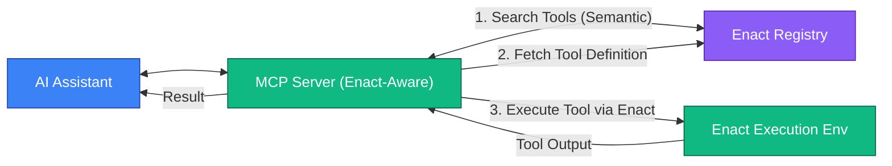

# Enact Protocol

  [](https://discord.gg/mMfxvMtHyS)

## What is Enact?

Enact is a complementary protocol that extends and enhances the Model Context Protocol (MCP) ecosystem by providing a standardized framework for defining, packaging, discovering, securing, and executing AI tools.

While MCP defines how AI applications communicate with tools within a given context, Enact addresses crucial aspects of tool management that MCP doesn't natively specify:

* **Discovery**: Finding relevant tools across a broad ecosystem
* **Packaging**: Ensuring consistent and reliable execution
* **Versioning**: Guaranteeing reproducibility
* **Security**: Cryptographic signatures and execution sandboxing
* **Management**: Standardized environment configurations

With Enact, a tool definition is enhanced with the necessary metadata for its entire lifecycle:

```yaml
enact: 0.0.1         # Enact Protocol version
name: HelloWorldTool
description: A discoverable, versioned, and securely executable Hello World example.
type: "npx"          # Defines execution type (e.g., npx, mcp, docker, wasm, http)
source: "my-hello-world-npx-package" # The resolvable source of the tool
version: "1.0.0"     # Semantic version of the tool itself
inputSchema:
  type: object
  properties:
    name:
      type: string
      description: "Name to include in the greeting."
  required: ["name"]
run:
  args: ["--name={{name}}"]
# ... plus fields for outputSchema, security signatures, timeouts, annotations, etc.
```

Think of Enact as providing the critical infrastructure layer for the MCP tool ecosystem: a universal, **semantically searchable** registry for tool discovery, and a standardized execution environment.

## Enact and MCP: Complementary Protocols

Enact is designed to work seamlessly with the Model Context Protocol (MCP), an open standard created by Anthropic that defines how AI applications communicate with external tools. While MCP provides the communication protocol between AI clients and tools, Enact adds:

1. **Tool Registry and Discovery**: Semantically searchable repositories of tools
2. **Tool Packaging and Versioning**: Reproducible execution with version pinning
3. **Security Features**: Cryptographic signatures and execution timeouts
4. **Environment Management**: Standardized handling of runtime configurations

Together, MCP and Enact create a robust ecosystem where AI tools can be defined, shared, discovered, secured, and executed in a standardized way.

## Architecture

The Enact Protocol works alongside MCP to enhance the AI tool ecosystem:

```mermaid
flowchart TB
    subgraph "Developer Workflow"
        CLI["Enact CLI (e.g., enact publish)"]
    end

    subgraph "AI System"
        LLM["Large Language Model"]
        MCPClient[MCP Client]
        MCPServer[MCP Server (Enact-Aware)]
    end

    subgraph "Enact Ecosystem"
        Registry[Tool Registry (Semantically Searchable)]
        ExecEnv[Execution Environment]
    end

    LLM <--> MCPClient
    MCPClient <--> MCPServer
    MCPServer <-->|search-tools (semantic)| Registry
    MCPServer <-->|register-tool (as MCP tool)| Registry

    CLI -->|publish-tool| Registry

    MCPServer -->|executes via Enact| ExecEnv

    classDef ai fill:#6366F1,stroke:#312E81,stroke-width:1px,color:white
    classDef enact fill:#10B981,stroke:#065F46,stroke-width:1px,color:white
    classDef dev fill:#7C3AED,stroke:#5B21B6,stroke-width:1px,color:white

    class LLM,MCPClient ai
    class Registry,ExecEnv,MCPServer enact
    class CLI dev
```

The core components of this architecture are:

* **MCP Client & LLM**: The AI application that communicates with tools through the MCP protocol.
* **MCP Server (Enact-Aware)**: Handles MCP protocol communication and integrates with the Enact ecosystem.
* **Enact Registry**: A searchable catalog of tools with their definitions, versions, and metadata.
* **Execution Environment**: Runs the tool code securely based on the tool's definition (could be containerized or run directly on the user's machine depending on configuration).
* **Enact CLI**: Developer tool for publishing and managing tools in the Enact ecosystem.

## Core Concepts

### Tools

Enact tools are the basic building blocks of the Enact Protocol. Each **tool** is defined with a YAML specification that follows the Enact Protocol Schema and can be seamlessly exposed as MCP tools.

**Required Fields:**
```yaml
enact: 0.0.1         # Version of the Enact Protocol schema being used
name: string         # Unique identifier for the tool
description: string  # Human-readable description
type: string         # Execution type (npx, mcp, docker, wasm, http)
source: string       # Package, server, or resource

inputSchema:         # Input parameters (JSON Schema)
  type: object
  properties: {}     # Tool-specific parameters
  required: []       # Required property names

# Type-specific execution configuration
run:
  args: [string]     # For NPX execution
  tool: string       # For MCP execution
  # Other configurations depending on type
```

**Optional Fields:**
```yaml
version: string      # Tool version information
commit: string       # Specific commit hash (for version pinning)

outputSchema:        # Output parameters (JSON Schema)
  type: object
  properties: {}
  required: []

run:
  timeout: number    # Maximum execution time in milliseconds

signature:           # Security verification
  value: string
  signer: string

annotations:         # MCP-aligned annotations
  title: string
  readOnlyHint: boolean
  destructiveHint: boolean
  idempotentHint: boolean
  openWorldHint: boolean
```

### Examples

**NPX Tool Example:**
```yaml
enact: 0.0.1
name: WordCounter
description: "Count words in text"
type: "npx"
source: "word-counter-tool" # Assumed to be an npm package
version: "1.2.0"
commit: "abc123def456789" # Optional specific commit hash from its repository
inputSchema:
  type: object
  properties:
    text:
      type: string
      description: "Text to count words in"
  required: ["text"]
run:
  args: ["--text={{text}}"] # Templated argument
  timeout: 30000           # 30 seconds timeout
annotations:
  title: "Word Counter"
  readOnlyHint: true
  idempotentHint: true
```

**MCP Tool Example:**
```yaml
enact: 0.0.1
name: McpEchoViaEnact
description: "Echo a message using an existing MCP tool on another server, managed by Enact"
type: "mcp"
source: "@modelcontextprotocol/server-everything" # Identifier for the target MCP server/service
version: "0.1.0" # Version of this Enact definition for calling the MCP tool
inputSchema:
  type: object
  properties:
    message:
      type: string
      description: "Message to echo back"
  required: ["message"]
run:
  tool: "echoOnRemoteServer" # The specific tool name on the source MCP server
  timeout: 5000 # 5 seconds timeout
annotations:
  title: "MCP Echo (via Enact)"
  readOnlyHint: true
  openWorldHint: false
```

## Parameter Management with JSON Schema

Both input and output parameters are defined using JSON Schema, allowing for rich validation, documentation, and type checking:

```yaml
inputSchema:
  type: object
  properties:
    paramName:
      type: string      # Data type (string, number, boolean, object, array)
      description: string # Parameter description
      format: string      # Optional format specifier (e.g., "date-time", "email")
      default: any        # Optional default value
      # Any other JSON Schema validation keywords
  required: ["paramName"] # Array of required parameter names
```

A recommended pattern for `outputSchema` to handle both successful results and errors:

```yaml
outputSchema:
  type: object
  properties:
    result:
      type: object # Or any other type representing the successful output
      description: "The successful operation result"
    error:
      type: object
      properties:
        message:
          type: string
        code:
          type: string # Or number
      required: ["message"]
      description: "Error information if the operation failed"
  oneOf: # Ensures that either result or error is present, but not both
    - required: ["result"]
    - required: ["error"]
```

## Environment Variables

Environment variables for tools are scoped by their `source` identifier. This allows multiple tools from the same source to share environment configurations without conflicts.

Environment variables are stored separately from tool definitions, typically in a configuration file:

**Location of Environment Variables:**
- **Linux/macOS**: `~/.enact/env.yaml`
- **Windows**: `%USERPROFILE%\.enact\env.yaml`

**Example Environment Variable Configuration:**
```yaml
# Source identifier from the Enact tool definition
"@modelcontextprotocol/server-everything":
  REMOTE_API_KEY: "mcp-api-key-123" # Key needed by the remote MCP server
  DEBUG_LEVEL: "verbose"

# Another source identifier
"word-counter-tool": # Matches the 'source' in the NPX example
  LANGUAGE_MODEL_PATH: "/models/english_default.bin"
  DEFAULT_DICTIONARY: "extended"
```

When a tool with `source: "word-counter-tool"` is executed, it automatically has access to its corresponding environment variables.

## Security Features

### Commit Pinning

For tools sourced from version control systems, Enact supports pinning executions to specific commit hashes for security and reproducibility:

```yaml
name: SecureTool
description: "A tool pinned to a specific commit"
type: "npx"
source: "github:org/repo"
commit: "abc123def456"
# ... other fields
```

This ensures that tools always execute the exact code that was verified, preventing supply chain attacks.

### Execution Timeouts

To ensure reliability and protect resources, each tool can specify a maximum execution time:

```yaml
run:
  args: ["--input={{dataFile}}"]
  timeout: 120000  # 2 minutes timeout
```

If a tool execution exceeds its specified timeout, it will be terminated automatically.

### Signatures

Enact tool definitions can be cryptographically signed to verify their authenticity and integrity:

```yaml
signature:
  value: "MEUCIDWjMXPWhFS/1Ah3yLG4PyKrideWS/5viCLlbTb4XAC8AiEAyaT2OI1dsCryLry+RZSmvN3IYIDjfJQYM5IwS7Usgzs="
  signer: "registry-id"
```

The signature is created by signing the canonical JSON representation of the Enact document with the registry's private key. This allows clients to verify the authenticity of tools before execution.

## Using with Model Context Protocol (MCP)

Enact tools can be dynamically discovered and executed through the Model Context Protocol, enabling AI agents to access the full range of tools in the Enact ecosystem.

### MCP Integration Mechanisms

1. **Dynamic Tool Discovery & Registration**:
   - An MCP tool, often named `enact-search-capabilities`, allows the AI agent to search the Enact Registry. This search can leverage the registry's **semantic understanding** of tool capabilities.
   - Found Enact tools can then be dynamically translated and registered as MCP tools within the current context, making them immediately available for use by the AI agent.

2. **Direct Tool Execution**:
   - An MCP tool, such as `execute-capability-by-id`, provides direct execution of any Enact tool using its unique ID.
   - This allows for on-demand execution of Enact tools that may not have been pre-registered as specific MCP tools in the current session.



This integration ensures that AI agents can leverage the growing Enact ecosystem of tools in a standardized, secure, and efficient manner.

## Key Advantages Enact Brings to MCP Tooling

1. **Unified Execution Model**: Enact's `type`, `source`, and `run` fields standardize how tools are executed, irrespective of their underlying technology.
2. **Enhanced Discovery and Distribution**: Enact tools are designed for discoverability in registries, notably through **semantic search**.
3. **Robust Security Features**: Enact incorporates commit pinning, execution timeouts, and cryptographic signatures for enhanced security.
4. **Cross-Platform Compatibility**: Enact tools can be executed consistently across different environments.
5. **Standardized Environment Management**: Enact provides a consistent mechanism for managing environment variables.
6. **Comprehensive Lifecycle Management**: Enact facilitates tool versioning and enables better dependency awareness.
7. **Clearer Separation of Concerns**: MCP can focus on agent-tool interaction, while Enact handles tool packaging, distribution, and execution.

## Contributing

We welcome contributions to the Enact Protocol! Whether it's proposing new features, improving documentation, or developing tools, your input is valuable.
You can start by opening an issue, submitting a Pull Request, or joining our [Discord](https://discord.gg/mMfxvMtHyS).

Contributing a new tool to the ecosystem is as simple as defining its Enact YAML manifest and publishing it to a registry using the `enact publish .` command (once you have the Enact CLI set up).

> "Perfection is achieved not when there is nothing more to add, but when there is nothing left to take away."
>
> — *Antoine de Saint-Exupéry*

## License

This project is licensed under the [MIT License](LICENSE).

---

© 2025 Enact Protocol Contributors