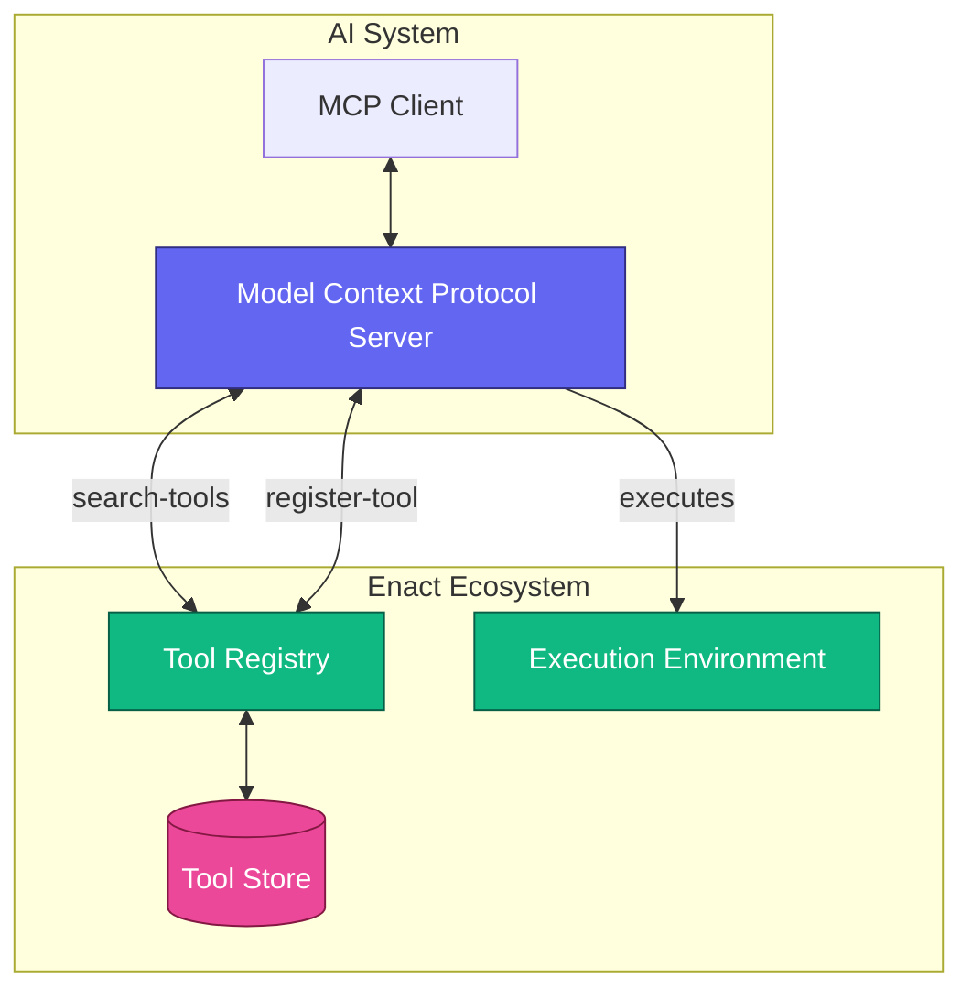
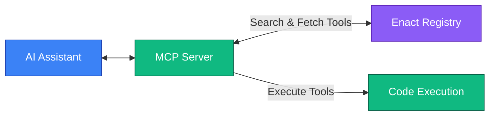
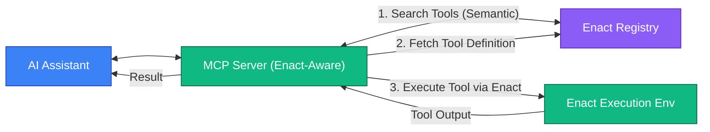

# Enact Protocol

  [](https://discord.gg/mMfxvMtHyS)

The **Enact Protocol** provides a standardized framework for defining and executing tools that can be seamlessly integrated with the Model Context Protocol (MCP). It enables the creation of reusable, composable, and verifiable tools that can be dynamically discovered and executed by AI agents and other automated systems.

## Overview

At its simplest, an Enact tool is defined with a structured description in YAML:

```yaml
enact: 0.0.1
name: HelloWorld
description: A simple Hello World example
type: "npx"
source: "hello-world-npx"
inputSchema:
  type: object
  properties: {}
  required: []
```

Enact addresses a critical need in the AI ecosystem: as AI agents become more capable, they require reliable access to a diverse set of tools. Enact provides a standardized protocol for defining, discovering, and executing these tools at runtime. Think of it as a universal registry and execution environment for AI tools, perfectly complementing MCP's tool integration capabilities.

## Architecture

The Enact Protocol consists of several key components that work together with MCP:


## Core Concepts

### Tools

Enact tools are the basic building blocks of the Enact Protocol. Each **tool** is defined with a YAML specification that follows the Enact Protocol Schema and can be seamlessly exposed as MCP tools.

**Required Fields:**
```yaml
enact: 0.0.1
name: string          # Unique identifier for the tool
description: string   # Human-readable description
type: string          # Execution type (npx, mcp, etc.)
source: string        # Package, server, or resource

inputSchema:          # Input parameters (JSON Schema)
  type: object
  properties: {}      # Tool-specific parameters
  required: []        # Required property names

run:                  # Execution configuration
  args: [string]      # For NPX execution
  tool: string        # For MCP execution
```

**Optional Fields:**
```yaml
version: string       # Tool version information
commit: string        # Specific commit hash (for version pinning)

outputSchema:         # Output parameters (JSON Schema)
  type: object
  properties: {}
  required: []

run:
  timeout: number     # Maximum execution time in milliseconds

signature:            # Security verification
  value: string
  signer: string

annotations:          # MCP-aligned annotations
  title: string
  readOnlyHint: boolean
  destructiveHint: boolean
  idempotentHint: boolean
  openWorldHint: boolean
```

### Examples

**NPX Tool Example:**
```yaml
name: WordCounter
description: "Count words in text"
type: "npx"
source: "word-counter-tool"
commit: "abc123def456789" # Optional specific commit hash
inputSchema:
  type: object
  properties:
    text:
      type: string
      description: "Text to count words in"
  required: ["text"]
run:
  args: ["--text={{text}}"]
  timeout: 30000      # 30 seconds timeout
annotations:
  title: "Word Counter"
  readOnlyHint: true
  idempotentHint: true
```

**MCP Tool Example:**
```yaml
name: McpEcho
description: "Echo a message using MCP"
type: "mcp"
source: "@modelcontextprotocol/server-everything"
inputSchema:
  type: object
  properties:
    message:
      type: string
      description: "Message to echo back"
  required: ["message"]
run:
  tool: "echo"
  timeout: 5000       # 5 seconds timeout
annotations:
  title: "Echo Tool"
  readOnlyHint: true
  openWorldHint: false
```

## Parameter Management with JSON Schema

Both input and output parameters are defined using JSON Schema, allowing for rich validation and documentation:

```yaml
inputSchema:
  type: object
  properties:
    paramName:
      type: string        # Data type (string, number, boolean, object, array)
      description: string # Parameter description
      format: string      # Optional format specifier
      default: any        # Optional default value
      # Any other JSON Schema validation keywords
  required: ["param1", "param2"]  # Array of required parameter names
```

```yaml
outputSchema:
  type: object
  properties:
    result:
      type: object
      description: "The operation result"
    error:
      type: object
      description: "Error information if applicable"
  oneOf:
    - required: ["result"]
    - required: ["error"]
```

## Environment Variables

Environment variables for tools are scoped by their `source` identifier. This allows multiple tools from the same source to share environment configurations.

Environment variables are stored separately from tool definitions, typically in a configuration file:

**Location of Environment Variables:**
- **Linux/macOS**: `~/.enact/env.yaml`
- **Windows**: `%USERPROFILE%\.enact\env.yaml`

**Example Environment Variable Configuration:**
```yaml
"@modelcontextprotocol/server-everything":  # Source identifier
  API_KEY: "mcp-api-key-123"
  DEBUG: "false"

"data-processor-package":  # Another source
  DATA_API_KEY: "data-api-key-456"
  TIMEOUT: "30"
```

When a tool with `source: "data-processor-package"` is executed, it automatically has access to the corresponding environment variables.

## Security Features

### Commit Pinning

Enact supports pinning tool executions to specific commit hashes for security and reproducibility:

```yaml
name: SecureTool
description: "A tool pinned to a specific commit"
type: "npx"
source: "github:org/repo"
commit: "abc123def456"
# ... other fields
```

This ensures that tools always execute the exact code that was verified, preventing supply chain attacks.

### Execution Timeouts

To ensure reliability and resource protection, each tool can specify a maximum execution time:

```yaml
run:
  args: ["--input={{dataFile}}"]
  timeout: 120000  # 2 minutes timeout
```

If a tool execution exceeds its specified timeout, it will be terminated automatically.

### Signatures

Enact tools support cryptographic signatures to verify authenticity and integrity:

```yaml
signature:
  value: "MEUCIDWjMXPWhFS/1Ah3yLG4PyKrideWS/5viCLlbTb4XAC8AiEAyaT2OI1dsCryLry+RZSmvN3IYIDjfJQYM5IwS7Usgzs="
  signer: "registry-id"
```

The signature is created by signing the canonical JSON representation of the Enact document with the registry's private key. This allows clients to verify the authenticity of tools before execution.

## Using with Model Context Protocol (MCP)

Enact tools can be dynamically discovered and executed through the Model Context Protocol, enabling AI agents to access the full range of tools in the Enact ecosystem.

### MCP Integration

The Enact Protocol works with MCP through two primary mechanisms:

1. **Dynamic Tool Discovery**: 
   - The `enact-search-capabilities` MCP tool allows searching the Enact registry for tools that match specific criteria
   - Found tools are automatically registered as MCP tools, making them immediately available for use

2. **Direct Tool Execution**:
   - The `execute-capability-by-name` MCP tool provides direct execution of any Enact tool using its name
   - This allows for execution of tools that may not be pre-registered as MCP tools



## Contributing
We welcome contributions to the Enact Protocol! You can start by making a PR or joining our [Discord](https://discord.gg/mMfxvMtHyS)

> "Perfection is achieved not when there is nothing more to add, but when there is nothing left to take away."
>
> — *Antoine de Saint-Exupéry*

## License

This project is licensed under the [MIT License](LICENSE).

---

© 2025 Enact Protocol Contributors


## Enact: Extending MCP Tools

The Enact Protocol extends the Model Context Protocol (MCP) tool system to provide a standardized way to define and execute tools across different environments. While MCP defines how tools are exposed and invoked within a conversation context, Enact provides a broader framework for tool discovery, packaging, and execution.

### Relationship to MCP Tools

MCP tool definitions look like this:
```json
{
  "name": "calculate_sum",
  "description": "Add two numbers together",
  "inputSchema": {
    "type": "object",
    "properties": {
      "a": { "type": "number" },
      "b": { "type": "number" }
    },
    "required": ["a", "b"]
  },
  "annotations": {
    "title": "Calculate Sum",
    "readOnlyHint": true,
    "openWorldHint": false
  }
}
```

Enact builds on this foundation by adding execution information and standardizing how tools are packaged, distributed, and executed:

```yaml
enact: 0.0.1
name: calculate_sum
description: "Add two numbers together"
type: "npx"
source: "math-utilities"
inputSchema:
  type: "object"
  properties:
    a:
      type: "number"
      description: "First number"
    b:
      type: "number"
      description: "Second number"
  required: ["a", "b"]
run:
  args: ["--operation=sum", "--a={{a}}", "--b={{b}}"]
annotations:
  title: "Calculate Sum"
  readOnlyHint: true
  openWorldHint: false
```

### Benefits of the Enact Extension

1. **Unified Execution Model**: Enact adds the `type`, `source` and `run` fields to standardize how tools are executed
2. **Discovery and Distribution**: Enact tools can be indexed, searched, and distributed through registries
3. **Security Features**: Commit pinning, signatures, and timeouts enhance security
4. **Cross-Platform Compatibility**: Tools can be executed consistently across different environments
5. **Environment Management**: Standardized handling of environment variables and context

### Using Enact with MCP

Enact tools are fully compatible with MCP and can be seamlessly integrated into MCP servers. The Enact Protocol provides MCP tools that enable:

1. **Tool Discovery**: `enact-search-capabilities` allows searching for relevant tools
2. **Tool Registration**: Found tools are automatically registered as MCP tools
3. **Tool Execution**: `execute-capability-by-id` enables direct execution of any Enact tool
```

This approach positions Enact as a natural extension to MCP tools, showing how it builds on the MCP foundation while adding important capabilities for tool discovery, distribution, and execution. It helps users understand that if they're already familiar with MCP tools, Enact is a logical next step for creating more powerful, distributable tools.

What do you think about this approach? Would you like to emphasize any particular aspects of the relationship between Enact and MCP?


Okay, I understand. You want to immediately frame Enact in the context of MCP, highlighting MCP's current tool definition capabilities and then pointing out the gaps (like discovery and security) that Enact is designed to fill. This is a strong approach to quickly establish the value proposition for users already familiar with or considering MCP.

Let's restructure the beginning of the README to reflect this:

-----

# Enact Protocol

  [](https://www.google.com/search?q=%5Bhttps://discord.gg/mMfxvMtHyS%5D\(https://discord.gg/mMfxvMtHyS\))

The Model Context Protocol (MCP) offers a foundational way for AI agents to interact with tools, often defining their interfaces using a JSON structure. For instance, a simple MCP tool definition might look like:

```json
{
  "name": "basic_mcp_tool",
  "description": "A conceptual MCP tool interface.",
  "inputSchema": {
    "type": "object",
    "properties": {
      "parameter": { "type": "string" }
    }
  }
}
```

While MCP defines *how* an agent can call a tool within a given context, it doesn't natively specify how these tools are:

  * **Discovered** across a broad ecosystem.
  * **Packaged** for consistent and reliable execution.
  * **Versioned** with guarantees of reproducibility.
  * **Secured** with features like cryptographic signatures or execution sandboxing.
  * **Managed** with standardized environment configurations.

As AI agents become more sophisticated, addressing these aspects is crucial for building robust, scalable, and trustworthy AI applications that can leverage a diverse set of capabilities.

The **Enact Protocol** is designed to solve exactly these issues. It extends and complements MCP by providing a standardized framework for defining, packaging, discovering, securing, and executing tools. Enact enables the creation of reusable, composable, and verifiable tools that can then be seamlessly integrated and utilized by MCP-driven AI agents and other automated systems.

With Enact, a tool definition is enhanced with the necessary metadata for its entire lifecycle:

```yaml
enact: 0.0.1         # Enact Protocol version
name: HelloWorldTool
description: A discoverable, versioned, and securely executable Hello World example.
type: "npx"          # Defines execution type (e.g., npx, mcp, docker, wasm, http)
source: "my-hello-world-npx-package" # The resolvable source of the tool
version: "1.0.0"     # Semantic version of the tool itself
inputSchema:
  type: object
  properties:
    name:
      type: string
      description: "Name to include in the greeting."
  required: ["name"]
run:
  args: ["--name={{name}}"]
# ... plus fields for outputSchema, security signatures, timeouts, annotations, etc.
```

Think of Enact as providing the critical infrastructure layer for an AI tool ecosystem: a universal, **semantically searchable** registry for discovery, and a standardized execution environment. Developers can easily contribute tools to registries using a simple command-line interface (e.g., `enact publish .`), fostering a rich and growing ecosystem.

## Architecture

The Enact Protocol consists of several key components that work in concert, often alongside an MCP server:

```mermaid
flowchart TB
    subgraph "Developer Workflow"
        CLI["Enact CLI (e.g., enact publish)"]
    end

    subgraph "AI System"
        MCPClient[MCP Client]
        MCPServer[Model Context Protocol Server (Enact-Aware)]
    end

    subgraph "Enact Ecosystem"
        Registry[Tool Registry (Semantically Searchable)]
        ExecEnv[Execution Environment]
        ToolStore[(Tool Store/Cache)]
    end

    MCPClient <--> MCPServer
    MCPServer <-->|search-tools (semantic)| Registry
    MCPServer <-->|register-tool (as MCP tool)| Registry

    CLI -->|publish-tool| Registry

    Registry <--> ToolStore

    MCPServer -->|executes via Enact| ExecEnv

    classDef ai fill:#6366F1,stroke:#312E81,stroke-width:1px,color:white
    classDef enact fill:#10B981,stroke:#065F46,stroke-width:1px,color:white
    classDef external fill:#F59E0B,stroke:#92400E,stroke-width:1px,color:white
    classDef data fill:#EC4899,stroke:#831843,stroke-width:1px,color:white
    classDef dev fill:#7C3AED,stroke:#5B21B6,stroke-width:1px,color:white

    class MCPClient,MCPServer ai
    class Registry,ExecEnv enact
    class ToolStore data
    class CLI dev
```

  * **Enact CLI:** Allows developers to package, validate, and publish their tools to an Enact Registry.
  * **Tool Registry:** A central or distributed catalog where Enact tools are stored, versioned, and made discoverable. It supports semantic search to find tools based on their capabilities.
  * **Tool Store/Cache:** A local or remote storage for tool packages and metadata, facilitating efficient retrieval.
  * **Execution Environment:** The runtime responsible for securely executing tools based on their definition (e.g., running an NPX package, calling another MCP tool, executing a container).
  * **MCP Server Integration:** An Enact-aware MCP Server can search the Registry, dynamically register tools as MCP capabilities, and delegate their execution to the Enact Execution Environment. Implementations of such servers already demonstrate this integration.

## Core Concepts

### Tools

Enact tools are the basic building blocks. Each **tool** is defined by a YAML specification that follows the Enact Protocol Schema. These tools can be seamlessly exposed as MCP tools.

**Required Fields:**

```yaml
enact: 0.0.1         # Version of the Enact Protocol schema being used
name: string           # Unique identifier for the tool (e.g., "MyAwesomeTool")
description: string    # Human-readable description of what the tool does
type: string           # Execution type (e.g., "npx", "mcp", "docker", "wasm", "http")
                       # Defines how the tool is executed.
source: string         # Identifier for the tool's executable code or endpoint.
                       # Examples: npm package ("my-npx-tool"), an MCP server tool ID
                       # ("@another-protocol/some-tool"), a Docker image name ("user/my-image"),
                       # a URL for an HTTP tool.

inputSchema:           # Input parameters definition using JSON Schema
  type: object
  properties: {}       # Tool-specific input parameters
  required: []         # Array of required input parameter names

# For 'npx', 'docker', or similar execution types that involve running a command:
run:
  args: [string]       # Array of arguments to pass to the command, allowing
                       # templating of input parameters (e.g., ["--input={{inputValue}}"])

# For 'mcp' execution type:
run:
  tool: string         # The name of the target tool on the source MCP server

# For 'http' execution type (example):
# run:
#   method: string     # HTTP method (GET, POST, PUT, etc.)
#   urlTemplate: string # URL template with placeholders for parameters
#   headers: object    # Optional headers
#   bodyTemplate: object # Optional body template for methods like POST/PUT
```

**Optional Fields:**

```yaml
version: string        # Semantic version of the tool itself (e.g., "1.0.2")
commit: string         # Specific commit hash for source control-based tools (for version pinning)

outputSchema:          # Output parameters definition (JSON Schema)
  type: object
  properties: {}
  required: []

run: # (extended for optional execution controls)
  timeout: number      # Maximum execution time in milliseconds
  # other type-specific run configurations can be added here

signature:             # Security verification for the tool definition
  value: string        # The cryptographic signature of the canonical tool definition
  signer: string       # Identifier of the key or entity that signed the tool

annotations:           # MCP-aligned annotations providing hints to AI agents
  title: string        # A short, human-friendly display name for the tool
  readOnlyHint: boolean # Indicates if the tool only reads data and has no side effects
  destructiveHint: boolean# Indicates if the tool might make irreversible changes
  idempotentHint: boolean # Indicates if calling the tool multiple times with the same input
                         # has the same effect as calling it once
  openWorldHint: boolean # Indicates if the tool interacts with a dynamic, external environment
```

### Examples

**NPX Tool Example:**

```yaml
enact: 0.0.1
name: WordCounter
description: "Count words in text"
type: "npx"
source: "word-counter-tool" # Assumed to be an npm package
version: "1.2.0"
commit: "abc123def456789"   # Optional specific commit hash from its repository
inputSchema:
  type: object
  properties:
    text:
      type: string
      description: "Text to count words in"
  required: ["text"]
run:
  args: ["--text={{text}}"] # Templated argument
  timeout: 30000            # 30 seconds timeout
annotations:
  title: "Word Counter"
  readOnlyHint: true
  idempotentHint: true
```

**MCP Tool Example (Enact defining how to call another MCP tool):**

```yaml
enact: 0.0.1
name: McpEchoViaEnact
description: "Echo a message using an existing MCP tool on another server, managed by Enact"
type: "mcp"
source: "@modelcontextprotocol/server-everything" # Identifier for the target MCP server/service
version: "0.1.0" # Version of this Enact definition for calling the MCP tool
inputSchema:
  type: object
  properties:
    message:
      type: string
      description: "Message to echo back"
  required: ["message"]
run:
  tool: "echoOnRemoteServer" # The specific tool name on the source MCP server
  timeout: 5000 # 5 seconds timeout
annotations:
  title: "MCP Echo (via Enact)"
  readOnlyHint: true
  openWorldHint: false
```

## Parameter Management with JSON Schema

Both input and output parameters are defined using JSON Schema, allowing for rich validation, documentation, and type checking:

```yaml
inputSchema:
  type: object
  properties:
    paramName:
      type: string      # Data type (string, number, boolean, object, array)
      description: string # Parameter description
      format: string      # Optional format specifier (e.g., "date-time", "email")
      default: any        # Optional default value
      # Any other JSON Schema validation keywords (e.g., pattern, minimum, maxLength)
  required: ["paramName"] # Array of required parameter names
```

A recommended pattern for `outputSchema` to handle both successful results and errors:

```yaml
outputSchema:
  type: object
  properties:
    result:
      type: object # Or any other type representing the successful output
      description: "The successful operation result"
    error:
      type: object
      properties:
        message:
          type: string
        code:
          type: string # Or number
      required: ["message"]
      description: "Error information if the operation failed"
  oneOf: # Ensures that either result or error is present, but not both
    - required: ["result"]
    - required: ["error"]
```

## Environment Variables

Environment variables for tools are scoped by their `source` identifier. This allows multiple tools from the same source (e.g., different tools within the same NPX package or Docker image) to share environment configurations without conflicts.

Environment variables are stored separately from tool definitions, typically in a configuration file managed by the Enact execution environment:

**Location of Environment Variables (Example):**

  * **Linux/macOS**: `~/.enact/env.yaml`
  * **Windows**: `%USERPROFILE%\.enact\env.yaml`

**Example Environment Variable Configuration (`env.yaml`):**

```yaml
# Source identifier from the Enact tool definition
"@modelcontextprotocol/server-everything":
  REMOTE_API_KEY: "mcp-api-key-123" # Key needed by the remote MCP server
  DEBUG_LEVEL: "verbose"

# Another source identifier
"word-counter-tool": # Matches the 'source' in the NPX example
  LANGUAGE_MODEL_PATH: "/models/english_default.bin"
  DEFAULT_DICTIONARY: "extended"
```

When a tool with `source: "word-counter-tool"` is executed, it automatically has access to its corresponding environment variables.

## Security Features

### Commit Pinning

For tools sourced from version control systems (implicitly or explicitly via `source` format), Enact supports pinning executions to specific commit hashes using the `commit` field for enhanced security and reproducibility. This helps prevent supply chain attacks by ensuring that tools execute only the verified code.

### Execution Timeouts

To ensure reliability and protect resources, each tool can specify a maximum execution time via `run.timeout`. If a tool execution exceeds its specified timeout, it will be terminated automatically by the Execution Environment.

### Signatures

Enact tool definitions can be cryptographically signed using the `signature` block to verify their authenticity and integrity. The signature is typically created by signing the canonical JSON representation of the Enact document. Clients and execution environments can then verify this signature using the signer's public key.

## Using with Model Context Protocol (MCP)

As highlighted, Enact is designed to significantly enhance how tools are managed and utilized within an MCP-based AI system. An Enact-aware MCP server can bridge these two protocols effectively.

### MCP Integration Mechanisms

1.  **Dynamic Tool Discovery & Registration**:

      * An MCP tool, often named `enact-search-capabilities` (or similar), allows the AI agent or MCP client to search the Enact Registry. This search can leverage the registry's **semantic understanding** of tool capabilities.
      * Found Enact tools can then be dynamically translated and registered as MCP tools within the current context, making them immediately available for use by the AI agent.

2.  **Direct Tool Execution**:

      * An MCP tool, such as `execute-enact-tool-by-name`, can provide direct execution of any Enact tool using its unique `name` from the registry.
      * This allows for on-demand execution of Enact tools that may not have been pre-registered as specific MCP tools in the current session.

<!-- end list -->



This integration ensures that AI agents can leverage the growing Enact ecosystem of tools in a standardized, secure, and efficient manner.

## Contributing

We welcome contributions to the Enact Protocol\! Whether it's proposing new features, improving documentation, or developing tools, your input is valuable.
You can start by opening an issue, submitting a Pull Request, or joining our [Discord](https://discord.gg/mMfxvMtHyS).

Contributing a new tool to the ecosystem is as simple as defining its Enact YAML manifest and publishing it to a registry using the `enact publish .` command (once you have the Enact CLI set up).

> "Perfection is achieved not when there is nothing more to add, but when there is nothing left to take away."
>
> — *Antoine de Saint-Exupéry*

## License

This project is licensed under the [MIT License](https://www.google.com/search?q=LICENSE).

-----

© 2025 Enact Protocol Contributors

## Enact & MCP: A Synergistic Deep Dive

While the introduction has framed Enact in relation to MCP, this section provides a more detailed comparison and reiterates the specific advantages Enact brings to the table for MCP tool users.

### Baseline: MCP Tool Interfaces

As mentioned, MCP tool definitions focus primarily on the interface for an AI agent:

```json
{
  "name": "calculate_sum_mcp_only",
  "description": "Add two numbers together (MCP definition)",
  "inputSchema": {
    "type": "object",
    "properties": {
      "a": { "type": "number" },
      "b": { "type": "number" }
    },
    "required": ["a", "b"]
  },
  "annotations": {
    "title": "Calculate Sum (MCP)",
    "readOnlyHint": true,
    "openWorldHint": false
  }
}
```

This defines *what* the tool does from the agent's perspective but leaves the *how* of its broader management and execution largely unspecified.

### Enact: Adding the "How" and More

Enact takes this MCP interface concept and wraps it with the necessary operational metadata:

```yaml
enact: 0.0.1
name: calculate_sum_enact # Unique name in the Enact registry
description: "Add two numbers together using a standardized npx package"
type: "npx"
source: "math-utilities-npm-package" # The npm package that provides this functionality
version: "2.1.0"
inputSchema: # MCP-compatible input schema
  type: "object"
  properties:
    a:
      type: "number"
      description: "First number"
    b:
      type: "number"
      description: "Second number"
  required: ["a", "b"]
run:
  args: ["--operation=sum", "--a={{a}}", "--b={{b}}"] # How to execute the source
  timeout: 10000 # 10 seconds
outputSchema: # Example, could be more complex
  type: object
  properties:
    sum:
      type: number
  required: ["sum"]
annotations: # Same annotations as MCP, for AI agent hints
  title: "Calculate Sum (Enact/NPX)"
  readOnlyHint: true
  openWorldHint: false
```

### Key Advantages Enact Brings to MCP Tooling:

1.  **Unified Execution Model**: Enact's `type`, `source`, `version`, and `run` fields standardize *how* tools are fetched and executed, irrespective of their underlying technology (NPX, Docker, another MCP tool, Wasm, HTTP API, etc.). This abstraction simplifies integration for MCP server developers.
2.  **Enhanced Discovery and Seamless Distribution**: Enact tools are designed for discoverability in registries, notably through **semantic search**. The `enact publish .` CLI command streamlines distribution, empowering developers to easily share and version their tools, enriching the entire ecosystem.
3.  **Robust Security Features**: Beyond MCP's interface, Enact incorporates commit pinning for source integrity, execution timeouts for operational reliability, and cryptographic signatures for verifying the authenticity of tool definitions.
4.  **Cross-Platform and Cross-Environment Compatibility**: By abstracting execution details, Enact tools can be executed consistently across different systems and AI agent environments that adopt the Enact protocol for tool execution.
5.  **Standardized Environment Management**: Enact provides a consistent mechanism for managing and injecting necessary environment variables for tools, correctly scoped by their `source`.
6.  **Comprehensive Lifecycle Management**: Enact facilitates tool versioning (via `version` and `commit`), and enables better dependency awareness and potential for deprecation strategies through its registry-based approach.
7.  **Clearer Separation of Concerns**: MCP can focus on agent-tool interaction and context management, while Enact handles the complexities of tool packaging, distribution, and execution.

By adopting Enact, an MCP-based system gains access to a more dynamic, secure, and manageable toolset, ultimately making AI agents more capable and reliable.
