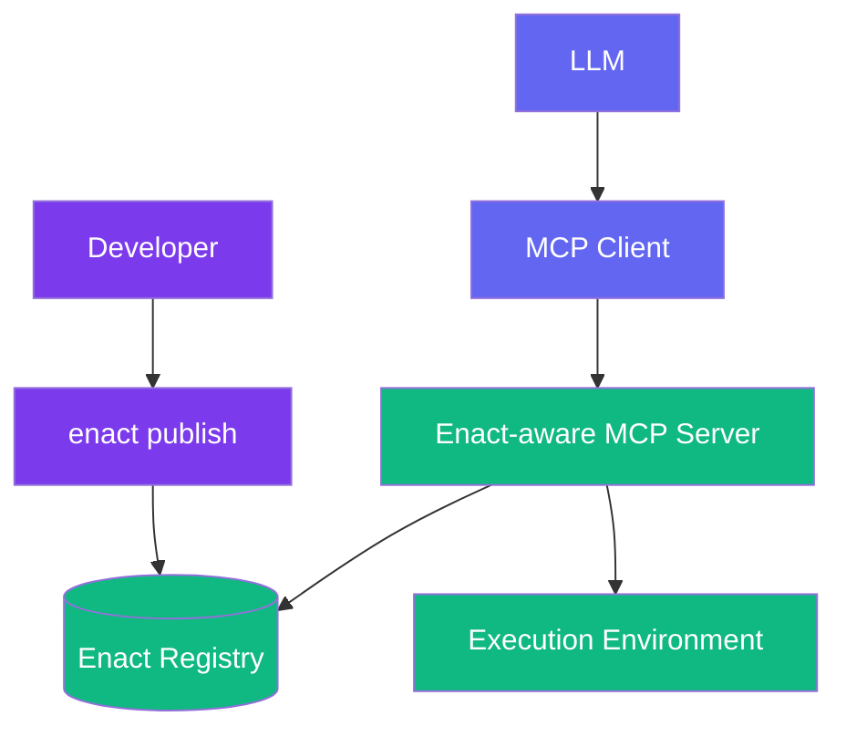

# Enact Protocol

  [](https://discord.gg/mMfxvMtHyS)

## What is Enact?

**Enact** revolutionizes how AI tools are defined, packaged, and shared.

Enact is a protocol that complements the [Model Context Protocol (MCP)](https://github.com/modelcontextprotocol) by providing a standardized way to define, package, discover, and secure AI tools.

While MCP enables communication between AI models and tools, **Enact handles the complete lifecycle of those tools**—ensuring they are:

* 🌐 **Discoverable** — semantically searchable across registries
* 📦 **Packaged** — defined in a consistent, executable format
* 🔐 **Secure** — protected with cryptographic signatures and verification
* 🕒 **Reproducible** — versioned with content pinning for reliability

> **Enact provides the standards for packaging, securing, and discovering tools**

---

## 🚀 Quick Start

### Your First Tool (3 lines!)

```yaml
name: HelloWorld
description: "Greets the world"
command: "echo 'Hello, ${name}!'"
```

That's it! This tool can now be published, discovered, and used by any AI model.

### A More Complete Example

```yaml
name: WordCounter
description: "Counts words in text"
command: "npx github:wordtools/counter#v1.2.3 --text='${text}' --format=${format}"
timeout: 30s

# Input validation
inputSchema:
  type: object
  properties:
    text:
      type: string
      description: "Text to analyze"
    format:
      type: string
      enum: ["json", "plain"]
      default: "json"
  required: ["text"]

# Test cases
examples:
  - input: {text: "hello world", format: "json"}
    output: '{"words": 2, "characters": 11}'
```

---

## 🧱 Core Concepts

### Universal Command Execution

Enact's superpower is its **universal command interface**. Any shell command works:

```yaml
# NPX with pinned versions
command: "npx github:org/tool#v1.2.3 --input='${data}'"
command: "npx github:org/tool#abc123def --input='${data}'"

# Docker with specific tags/digests
command: "docker run --rm my-tool:v1.0 '${input}'"
command: "docker run --rm my-tool@sha256:abc123... '${input}'"

# HTTP APIs (version in URL)
command: "curl -s 'https://api.example.com/v1/process' -d '${json}'"

# Shell pipelines
command: "cat ${file} | grep ${pattern} | wc -l"

# Complex workflows with pinned tools
command: |
  echo "Processing ${input}" &&
  npx github:org/validator#v2.1.0 --data='${input}' &&
  npx github:org/transformer#v1.5.2 --data='${input}' > output.json
```

### Progressive Complexity

Start simple, add features as needed:

**Level 1: Basic** (3 lines)
```yaml
name: MyTool
description: "Does something useful"
command: "npx my-tool '${input}'"
```

**Level 2: Standard** (+ validation & testing)
```yaml
name: MyTool
description: "Does something useful"
command: "npx github:myorg/my-tool#v1.2.3 '${input}'"
inputSchema:
  type: object
  properties:
    data:
      type: string
      description: "Input data"
    format:
      type: string
      enum: ["json", "xml"]
  required: ["data"]
```

**Level 3: Advanced** (+ signatures & environment)
```yaml
name: MyTool
description: "Does something useful"
command: "npx github:myorg/my-tool#abc123def '${input}'"
namespace: "tools.mycompany.analytics"
signatures:
  author: "MEUCIDWjMXPWhFS..."
  registry: "MEQCIHGmTlcwSxf..."
```

---

## 🧠 How Enact Extends MCP

MCP defines [tools](https://modelcontextprotocol.io/docs/concepts/tools) with a basic structure, but doesn't address the complete tool lifecycle. Enact fills this gap:

**MCP Tool Definition:**
```json
{
  "name": "string",          // Unique identifier for the tool
  "description": "string",   // Human-readable description (optional)
  "inputSchema": {           // JSON Schema for the tool's parameters
    "type": "object",
    "properties": {}         // Tool-specific parameters
  },
  "annotations": {           // Optional hints about tool behavior
    "title": "string",                // Human-readable title for the tool (optional)
    "readOnlyHint": false,           // If true, the tool does not modify its environment
    "destructiveHint": true,         // If true, the tool may perform destructive updates
    "idempotentHint": false,         // If true, repeated calls with same args have no additional effect
    "openWorldHint": true            // If true, tool interacts with external entities
  }
}
```

**Enact builds on this foundation** by adding essential lifecycle management capabilities that MCP doesn't address:

| Capability | MCP | Enact |
|------------|-----|-------|
| Communication Protocol | ✅ Defines interaction | ❌ Uses MCP |
| Tool Execution | ❌ Server implementation required | ✅ Universal command interface |
| Tool Discovery | ❌ | ✅ Semantic search & registry |
| Tool Packaging | ❌ | ✅ Standard YAML schema |
| Versioning & Reproducibility | ❌ | ✅ Version pinning & hashes |
| Security & Verification | ❌ | ✅ Cryptographic signatures |
| Environment Management | ❌ | ✅ Namespace isolation |

---

## 📋 Tool Definition Reference

### Essential Fields

```yaml
# Required
name: string         # Tool identifier
description: string  # What it does
command: string      # Shell command to execute (include version pins here)

# Recommended
namespace: string    # Environment variable namespace (e.g., "tools.enact.discord")
timeout: duration    # Default: 30s (e.g., "5m", "1h")
```

### Input Schema

Tools use [JSON Schema](https://json-schema.org/) for input validation:

```yaml
inputSchema:
  type: object
  properties:
    text:
      type: string
      description: "Text to analyze"
    format:
      type: string
      enum: ["json", "plain"]
      default: "json"
    count:
      type: integer
      minimum: 1
      maximum: 100
  required: ["text"]
```

### Tool Behavior Hints

```yaml
# Behavior hints (all default to false)
annotations:
  readOnlyHint: true      # Doesn't modify system
  idempotentHint: true    # Safe to retry
  destructiveHint: false  # Makes permanent changes
  openWorldHint: false    # Connects to internet
```

### Environment Variables

Environment variables are scoped by namespace with filesystem isolation:

```yaml
# Define tool namespace
namespace: "tools.enact.discord"

# Declare required environment variables
env:
  - "API_KEY"
  - "WEBHOOK_URL"
```

**Storage Structure:**
```bash
~/.enact/
└── env/
    └── tools/
        └── enact/
            └── discord/
                ├── .env          # User's actual secrets
                └── .env.example  # Template from tool
```

**Security Model:**
- Each tool execution reads ONLY from its namespace directory
- No access to parent process environment
- Secrets are stored in plain `.env` files (use OS file permissions for security)
- For additional security, use OS keychain or encrypted disk

**Example Usage:**
```yaml
name: DiscordNotifier
namespace: "tools.enact.discord"
description: "Send notifications to Discord"
command: "npx github:enact/discord-notify#v1.2.0 --key=$API_KEY --webhook=$WEBHOOK_URL --message='${message}'"
env:
  - "API_KEY"
  - "WEBHOOK_URL"
inputSchema:
  type: object
  properties:
    message:
      type: string
      description: "Message to send"
  required: ["message"]
```

### Testing & Examples

```yaml
examples:
  - input: {text: "hello world"}
    output: {words: 2}
  - input: {text: "one"}
    output: {words: 1}
```

---

## 🏗 Architecture



**Flow:**
1. Developer creates tool definition (YAML)
2. CLI validates and publishes to registry
3. AI models discover tools via semantic search
4. MCP server fetches and executes tools
5. Results return to AI model

---

## 🧪 Example Tools

### Text Analysis
```yaml
name: SentimentAnalyzer
description: "Analyzes sentiment of text"
command: "npx github:texttools/sentiment#v2.1.0 --text='${text}'"
tags: ["text", "analysis", "sentiment", "nlp"]
inputSchema:
  type: object
  properties:
    text:
      type: string
      description: "Text to analyze"
  required: ["text"]
examples:
  - input: {text: "I love this!"}
    output: {sentiment: "positive", score: 0.98}
annotations:
  readOnlyHint: true
  idempotentHint: true
```

### Image Processing
```yaml
name: ImageResizer
description: "Resizes images"
command: "docker run --rm imagetools:v3.2@sha256:abc123... resize --input='${url}' --width=${width}"
tags: ["image", "resize", "media", "processing"]
timeout: 2m
inputSchema:
  type: object
  properties:
    url:
      type: string
      format: uri
      description: "Image URL"
    width:
      type: integer
      description: "Target width in pixels"
      minimum: 1
      maximum: 4096
  required: ["url", "width"]
annotations:
  openWorldHint: true
```

### Data Pipeline
```yaml
name: CSVProcessor
description: "Validates and transforms CSV data"
command: |
  npx github:datatools/csv-validator#v1.0.5 --file='${file}' --schema='${schema}' &&
  npx github:datatools/csv-transform#v2.3.1 --file='${file}' --output=processed.csv
tags: ["data", "csv", "validation", "etl", "pipeline"]
timeout: 5m
inputSchema:
  type: object
  properties:
    file:
      type: string
      description: "CSV file path"
    schema:
      type: string
      format: uri
      description: "Validation schema URL"
  required: ["file"]
```

### API Integration
```yaml
name: WeatherFetch
namespace: "tools.enact.weather"
description: "Gets current weather"
command: "curl -s 'https://api.weather.com/v1/current?location=${city}&units=${units}&key=$API_KEY&timeout=${REQUEST_TIMEOUT:-10}'"
tags: ["weather", "api", "external", "location"]
env:
  API_KEY:
    description: "Weather API key for accessing current conditions"
    source: "https://weather.com/developers → Create Account → API Keys"
    required: true
  REQUEST_TIMEOUT:
    description: "API request timeout in seconds"
    default: "10"
    required: false
inputSchema:
  type: object
  properties:
    city:
      type: string
      description: "City name"
    units:
      type: string
      enum: ["metric", "imperial"]
      default: "metric"
      description: "Temperature units"
  required: ["city"]
annotations:
  openWorldHint: true
  idempotentHint: true
```

---

## 🔐 Security

### Version Pinning

Pin tools directly in commands for reproducibility:

```yaml
# NPX with GitHub and commits/tags
command: "npx github:org/tool#v1.2.3"
command: "npx github:org/tool#abc123def"

# NPM registry with versions
command: "npx my-tool@1.2.3"

# Docker with tags or digests
command: "docker run my-tool:v1.0"
command: "docker run my-tool@sha256:abc123..."

# URLs with version in path
command: "curl https://example.com/api/v2/process"
```

### Cryptographic Signatures

Verify tool authenticity with multi-party signatures:

```yaml
signatures:
  - algorithm: "sha256"
    type: "ecdsa-p256"
    signer: "developer@company.com"
    role: "author"
    created: "2025-01-15T10:30:00.000Z"
    value: "MEUCIDWjMXPWhFS/1Ah3yLG4PyKrideWS..."
    
  - algorithm: "sha256"
    type: "ecdsa-p256"
    signer: "enact-registry"
    role: "registry"
    created: "2025-01-15T11:45:00.000Z"
    value: "MEQCIHGmTlcwSxfJL8nTYtBGLpA9dKxI..."
```

**Signature Roles:**
- `author`: Original tool developer
- `registry`: Registry verification and approval
- `enterprise`: Enterprise security team approval
- `deployment`: Server deployment authorization


---

## 🛠 CLI Usage

```bash
# Create a new tool
enact init my-tool

# Validate tool definition
enact validate tool.yaml

# Test locally
enact test tool.yaml --input '{"text": "hello"}'

# Publish to registry
enact publish tool.yaml

# Search for tools
enact search "text analysis"
```

---

## 🌐 MCP Integration

Enact tools are automatically available to MCP clients:

```javascript
// Search for tools
const tools = await client.call('enact-search-capabilities', {
  query: 'sentiment analysis'
});

// Register and use a tool
await client.call('enact-register-capability', { id: tools[0].id });
const result = await client.call('execute-capability-by-id', {
  id: tools[0].id,
  args: { text: 'I love this!' }
});
```

---

## 🤝 Why Enact?

**For Developers:**
- Write tools in any language or technology
- Use familiar shell commands
- Test locally before publishing
- Version and sign your tools

**For AI Applications:**
- Discover tools semantically
- Trust verified tools
- Scale seamlessly
- Consistent execution model

**For Enterprises:**
- Control tool approval with signatures
- Audit tool usage and versions
- Ensure reproducibility
- Manage security policies

---

## 📚 Best Practices

### 1. Start Simple
Begin with the minimal 3-line format and add features as needed.

### 2. Use Descriptive Names
- ✅ `PDFToTextConverter`
- ❌ `pdf2txt`

### 3. Pin Dependencies
Always include version pins in your commands for reproducibility.

### 4. Test Your Tools
Include examples to verify behavior and document expected outputs.

### 5. Use Namespaces for Environment Variables
Group related tools and prevent variable conflicts:
- `tools.enact.discord` for Discord tools
- `tools.company.analytics` for company analytics tools
- `tools.personal.utils` for personal utilities

### 6. Document Behavior with Annotations
Use `readOnlyHint`, `idempotentHint`, `destructiveHint`, and `openWorldHint` to help AI models understand tool behavior.

### 7. Set Appropriate Timeouts
Match timeout values to expected execution time. Use longer timeouts for data processing, shorter for API calls.

### 8. Use Tags for Better Discovery
Add relevant tags to help users find your tools:
- ✅ `["text", "analysis", "sentiment"]` for sentiment analysis
- ✅ `["image", "resize", "media"]` for image processing
- ✅ `["data", "csv", "validation"]` for data tools

---

## 📋 Complete Field Reference

### Core Fields

```yaml
# Required fields
name: string         # Tool identifier (required)
description: string  # Human-readable description (required)
command: string      # Shell command to execute (required)

# Security and verification
version: string      # Version identifier (optional)

# Execution control
timeout: string      # Human-readable timeout (e.g., "30s", "5m", "1h")
namespace: string    # Environment variable namespace
env: object|[string] # Environment variables (detailed object or simple array)

# Schema definitions
inputSchema: object  # Input parameters as JSON Schema
outputSchema: object # Output structure as JSON Schema

# Discovery and categorization
tags: [string]       # Tags for search and categorization
```

### Documentation

```yaml
doc: string          # Markdown documentation
tags: [string]       # Tags for discovery and categorization
authors:             # Tool creators
  - name: string     # Author name (required)
    email: string    # Author email (optional)
    url: string      # Author website (optional)
```

### Metadata and Security

```yaml
annotations:         # MCP-aligned behavior hints
  title: string      # Human-readable display name
  readOnlyHint: boolean      # No environment modifications
  destructiveHint: boolean   # May make irreversible changes
  idempotentHint: boolean    # Multiple calls = single call
  openWorldHint: boolean     # Interacts with external systems

signatures:          # Array of signatures (optional)
  - algorithm: string # Hash algorithm (e.g., "sha256")
    type: string     # Signature algorithm (e.g., "ecdsa-p256")
    signer: string   # Signer identifier (email, server name, etc.)
    role: string     # Signature role (author, registry, enterprise, deployment)
    keyId: string    # Optional key identifier for rotation (optional)
    created: string  # ISO timestamp of signature creation
    expires: string  # Optional expiration timestamp (optional)
    value: string    # Cryptographic signature value (required)
```

### Testing and Examples

```yaml
examples:            # Test cases and expected outputs
  - input: object    # Input parameters
    output: any      # Expected output
    description: string # Optional test description
```

### Extensions

```yaml
x-*: any             # Custom extensions (must begin with 'x-')
```

---

## 🚧 Roadmap

**Current (Alpha)**
- ✅ Core protocol specification
- ✅ Universal command execution
- ✅ Basic MCP integration

**Next (Beta)**
- 🔄 Enhanced CLI with testing
- 🔄 Public registry launch
- 🔄 Signature verification
- 🔄 Advanced security policies

**Future**
- ⏳ Visual tool builder
- ⏳ Marketplace features
- ⏳ Performance optimizations
- ⏳ Multi-language execution environments

---

## 💬 Community

Join our growing community:

- 💬 [Discord](https://discord.gg/mMfxvMtHyS) - Chat with developers
- 🐛 [GitHub Issues](https://github.com/EnactProtocol/enact) - Report bugs
- 📖 [Documentation](https://docs.enact.tools) - Full reference
- 🌟 [Registry](https://enact.tools) - Browse tools

---

## 📄 License

MIT License - see [LICENSE](LICENSE) for details.

© 2025 Enact Protocol Contributors

---

*"Perfection is achieved not when there is nothing more to add, but when there is nothing left to take away."* — Antoine de Saint-Exupéry