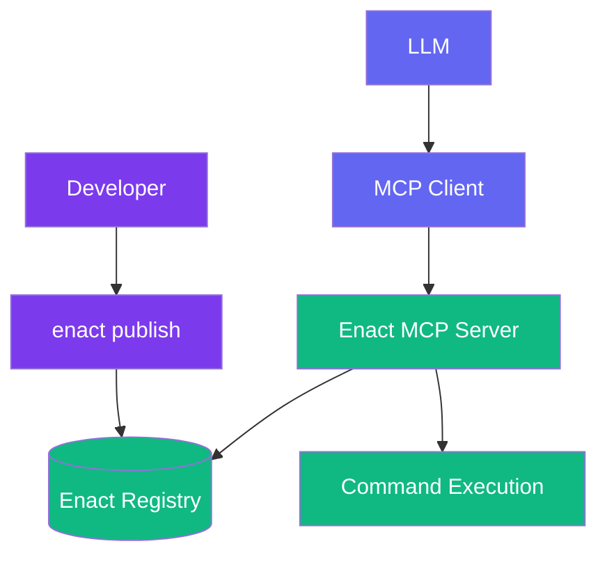

# Enact Protocol

  [](https://discord.gg/mMfxvMtHyS)

**Enact** revolutionizes how AI tools are defined, packaged, and shared.

## Enact in 30 Seconds

**Enact lets AI models use command-line tools safely and reliably.**

Instead of writing code integrations, you define tools with simple YAML:

```yaml
  name: hello-world
  description: "Greets the world"
  command: "echo 'Hello, ${name}!'"
```

That's it. This tool can now be:
- 🔍 **Discovered** by AI models searching for "hello world" or "greeting"
- 🚀 **Executed** safely without local installation
- 🔐 **Verified** with cryptographic signatures
- 📌 **Versioned** with standard semantic versioning

**Why Enact?**
- Any command-line tool becomes an AI tool
- No coding required - just YAML
- Built on the Model Context Protocol (MCP)
- Secure by default with signatures and versioning

**Get Started:**
```bash
# Install
npm install -g enact-cli

# Create your first tool
enact init my-tool

# Publish it
enact publish tool.yaml
```

Now any AI using MCP can discover and use your tool!

## Now in more detail

Enact is a protocol that complements the [Model Context Protocol (MCP)](https://github.com/modelcontextprotocol) by providing a standardized way to define, package, discover, and secure AI tools.

While MCP enables communication between AI models and tools, **Enact handles the complete lifecycle of those tools**—ensuring they are:

* 🌐 **Discoverable** — semantically searchable across registries
* 📦 **Packaged** — defined in a consistent, executable format
* 🔐 **Secure** — protected with cryptographic signatures and verification
* 🕒 **Versioned** — using pinning or familiar semantic versioning for reliability

> **Enact provides the standards for packaging, securing, and discovering tools**

---

## 🚀 Quick Start

### Your First Tool (3 lines!)

```yaml
name: NasaMarkdownCrawler
description: "Extracts markdown content from nasa website"
command: "uvx markdown-crawler@1.0.0 https://www.nasa.gov/news/"
```

That's it! This tool can now be published, discovered, and used by any AI model.

### A More Complete Example

```yaml
name: JSONFormatter
description: "Formats and validates JSON data"
command: "npx jq-cli@1.7.1 --raw-output '${filter}' <<< '${json}'"
timeout: "30s"

# Input validation (JSON Schema)
inputSchema:
  type: object
  properties:
    json:
      type: string
      description: "JSON data to process"
    filter:
      type: string
      description: "jq filter expression"
      default: "."
  required: ["json"]

# Test cases
examples:
  - input: {json: '{"name":"John","age":30}', filter: ".name"}
    output: "John"
```

---

## 🧱 Core Concepts

### Field Requirements

```yaml
# REQUIRED (minimum viable tool)
name: string         # Tool identifier
description: string  # What the tool does  
command: string      # Shell command to execute

# RECOMMENDED (production best practices)
timeout: string      # Execution timeout (Go duration format)
tags: [string]       # Search and categorization tags

# OPTIONAL (advanced features)
namespace: string    # Environment variable namespace
inputSchema: object  # JSON Schema for input validation
signature: object    # Cryptographic signature
resources: object    # Resource requirements
```

### Universal Command Execution

Enact's superpower is its **command interface** executed through the Enact MCP Server. Any shell command works:

```yaml
# NPX with version tags (recommended)
command: "npx prettier@3.3.3 --write '${file}'"
command: "npx eslint@9.0.0 --fix '${file}'"

# UVX for Python tools
command: "uvx black@24.4.2 '${file}'"
command: "uvx ruff@0.5.0 check '${file}'"

# Docker with specific tags
command: "docker run pandoc/core:3.1.11 -f markdown -t html '${input}'"

# HTTP APIs with versioned endpoints
command: "curl -s 'https://api.example.com/v1/process' -d '${json}'"

# Shell pipelines
command: "echo '${text}' | npx slugify-cli@2.0.0"

# Complex workflows
command: |
  echo "Processing ${input}" &&
  uvx pyyaml@6.0.1 validate &&
  npx prettier@3.3.3 --write output.yaml
```

**For maximum reproducibility**, you can also use commit hashes:
```yaml
# Using commit hashes for absolute immutability
command: "npx github:prettier/prettier#abc123def --write '${file}'"
command: "uvx --from git+https://github.com/psf/black@d47cbd5 black '${file}'"
```

### Progressive Complexity

Start simple, add features as needed:

**Level 1: Minimal** (3 required fields)
```yaml
name: SlugifyText
description: "Converts text to URL-friendly slugs"
command: "npx slugify-cli@2.0.0 '${text}'"
```

**Level 2: Production-Ready** (+ validation & metadata)
```yaml
enact: "1.0.0"
name: MarkdownToHTML
description: "Converts markdown to HTML with syntax highlighting"
command: "npx markdown-it@14.0.0 -o '${output}' '${input}'"
timeout: "30s"
tags: ["markdown", "html", "converter", "documentation"]

inputSchema:
  type: object
  properties:
    input:
      type: string
      description: "Markdown content or file path"
    output:
      type: string
      description: "Output HTML file path"  
      default: "output.html"
  required: ["input"]

# Output schema helps AI models understand tool responses
outputSchema:
  type: object
  properties:
    success:
      type: boolean
      description: "Whether conversion succeeded"
    outputPath:
      type: string
      description: "Path to generated HTML file"
  required: ["success", "outputPath"]
```

**Level 3: Enterprise** (+ environment & signatures)
```yaml
enact: 1.0.0
name: OpenAICodeReview
description: "Reviews code using OpenAI's API"
command: "uvx openai-cli@1.0.0 review --file='${file}' --model='${model}'"
timeout: "2m"
tags: ["ai", "code-review", "openai", "analysis"]
namespace: "tools.enact.openai"

env:
  OPENAI_API_KEY:
    description: "OpenAI API key for GPT access"
    source: "https://platform.openai.com/api-keys"
    required: true

inputSchema:
  type: object
  properties:
    file:
      type: string
      description: "Code file to review"
    model:
      type: string
      enum: ["gpt-4", "gpt-3.5-turbo"]
      default: "gpt-4"
  required: ["file"]

signature:
  algorithm: sha256
  signer: developer-id
  type: ecdsa-p256
  created: 2025-05-15T23:55:41.328Z
  value: MEUCICwNLAzYZQAul2/uhPkdjxNrNwkFWy2qYOGV5pWIpdabAiEAlpDsXUiOMKrXgIVZcddn6CoPsseC/3eLCSXEMOScg+M=
```

---

## 🧠 How Enact Extends MCP

MCP defines [tools](https://modelcontextprotocol.io/docs/concepts/tools) with a basic structure, but doesn't address the complete tool lifecycle. Enact fills this gap:

**MCP Tool Definition:**
```
{
  "name": "string",          // Unique identifier for the tool
  "description": "string",   // Human-readable description (optional)
  "inputSchema": {           // JSON Schema for the tool's parameters
    "type": "object",
    "properties": {}         // Tool-specific parameters
  }
}
```

**Enact builds on this foundation** by adding essential lifecycle management capabilities:

| Capability | MCP | Enact |
|------------|-----|-------|
| Communication Protocol | ✅ Defines interaction | ✅ Uses MCP protocol |
| Tool Execution | ❌ Server implementation required | ✅ Command-based execution via Enact MCP Server |
| Tool Discovery | ❌ | ✅ Semantic search & registry |
| Tool Packaging | ❌ | ✅ Standard YAML schema |
| Versioning | ❌ | ✅ Semantic versioning support |
| Security & Verification | ❌ | ✅ Cryptographic signatures |
| Environment Management | ❌ | ✅ Namespace isolation |

---

## 📋 Tool Definition Reference

### Required Fields

```yaml
name: string         # Tool identifier (must be unique)
description: string  # Human-readable description of what the tool does
command: string      # Shell command to execute (with versions or hash pins recommended)
```

### Recommended Fields

```yaml
timeout: string      # Execution timeout in Go duration format: "30s", "5m", "1h" (default: "30s")
tags: [string]       # Tags for search and categorization
```

### Optional Fields

```yaml
namespace: string    # Environment variable namespace (e.g., "tools.enact.discord")
version: string      # Tool definition version for tracking changes
```

### Input & Output Schemas (JSON Schema)

Tools use [JSON Schema](https://json-schema.org/) for input validation and output documentation:

```yaml
# Input validation (recommended for production tools)
inputSchema:
  type: object
  properties:
    text:
      type: string
      description: "Text to analyze"
    format:
      type: string
      enum: ["json", "plain"]
      default: "json"
    count:
      type: integer
      minimum: 1
      maximum: 100
  required: ["text"]

# Output schema (strongly recommended - helps AI models understand responses)
outputSchema:
  type: object
  properties:
    words:
      type: integer
      description: "Number of words found"
    characters:
      type: integer
      description: "Number of characters found"
    format:
      type: string
      description: "Output format used"
  required: ["words", "characters"]
```

### Tool Behavior Annotations

```yaml
# Behavior hints (all default to false, aligned with MCP)
annotations:
  readOnlyHint: true      # Tool doesn't modify the system
  idempotentHint: true    # Multiple calls produce same result as single call
  destructiveHint: false  # Tool may make permanent/irreversible changes
  openWorldHint: false    # Tool connects to external systems/internet
```

### Environment Variables

Environment variables use detailed object syntax for security and documentation:

```yaml
# Define tool namespace
namespace: "tools.enact.discord"

# Declare required environment variables
env:
  API_KEY:
    description: "Discord bot API key"
    source: "https://discord.com/developers → Create App → Bot → Token"
    required: true
  WEBHOOK_URL:
    description: "Discord webhook for notifications"
    source: "Server Settings → Integrations → Webhooks → Create"
    required: true
  REQUEST_TIMEOUT:
    description: "API request timeout in seconds"
    default: "10"
    required: false
```

**Storage Structure:**
```bash
~/.enact/
└── env/
    └── tools/
        └── enact/
            └── discord/
                ├── .env          # User's actual secrets
                └── .env.example  # Template from tool
```

**Security Model:**
- Each tool execution reads ONLY from its namespace directory
- No access to parent process environment
- Secrets stored in `.env` files (use OS file permissions)
- Simple security model to start, will enhance over time

### Testing & Examples

```yaml
examples:
  - input: {text: "hello world", format: "json"}
    output: {words: 2, characters: 11}
    description: "Basic word counting"
  - input: {text: "one"}
    output: {words: 1}
    description: "Single word test"
```

### Cryptographic Signatures

Tools can be signed for authenticity verification:

```yaml
signature:
  algorithm: sha256
  signer: developer-id
  type: ecdsa-p256
  created: 2025-05-15T23:55:41.328Z
  value: MEUCICwNLAzYZQAul2/uhPkdjxNrNwkFWy2qYOGV5pWIpdabAiEAlpDsXUiOMKrXgIVZcddn6CoPsseC/3eLCSXEMOScg+M=
```

---

## 🏗 Architecture



**Flow:**
1. Developer creates tool definition (YAML)
2. CLI validates and publishes to registry
3. AI models discover tools via semantic search
4. Enact MCP Server fetches and executes tool commands
5. Results return to AI model

---

## 🧪 Example Tools

### Text Analysis
```yaml
name: TextStatistics
description: "Analyzes text statistics and readability"
command: "npx text-stats-cli@1.0.0 '${text}'"
timeout: "30s"
tags: ["text", "analysis", "statistics", "readability"]

inputSchema:
  type: object
  properties:
    text:
      type: string
      description: "Text to analyze"
  required: ["text"]

examples:
  - input: {text: "The quick brown fox jumps over the lazy dog."}
    output: |
      {
        "words": 9,
        "characters": 44,
        "sentences": 1,
        "readability": "easy"
      }
    description: "Basic text analysis"

outputSchema:
  type: object
  properties:
    words:
      type: integer
      description: "Number of words"
    characters:
      type: integer
      description: "Number of characters"
    sentences:
      type: integer
      description: "Number of sentences"
    readability:
      type: string
      description: "Reading difficulty level"
```

### Code Formatting
```yaml
name: PrettierFormatter
description: "Formats code using Prettier"
command: "npx prettier@3.3.3 --write '${file}' --config '${config}'"
timeout: "1m"
tags: ["code", "formatter", "prettier", "javascript", "typescript"]

inputSchema:
  type: object
  properties:
    file:
      type: string
      description: "File or glob pattern to format"
    config:
      type: string
      description: "Path to prettier config"
      default: ".prettierrc"
  required: ["file"]

annotations:
  destructiveHint: true  # Modifies files in place
```

### Data Validation
```yaml
name: JSONSchemaValidator
description: "Validates JSON against a schema"
command: "npx ajv-cli@5.0.0 validate -s '${schema}' -d '${data}'"
timeout: "30s"
tags: ["json", "validation", "schema", "data"]

inputSchema:
  type: object
  properties:
    schema:
      type: string
      description: "Path to JSON schema file"
    data:
      type: string
      description: "Path to data file to validate"
  required: ["schema", "data"]

outputSchema:
  type: object
  properties:
    valid:
      type: boolean
      description: "Whether the data is valid"
    errors:
      type: array
      description: "Validation errors if any"
      items:
        type: object
```

### Web Scraping
```yaml
name: WebContentExtractor
description: "Extracts content from web pages as markdown"
command: "uvx markdown-crawler@2.1.0 '${url}' --depth='${depth}'"
timeout: "2m"
tags: ["web", "scraping", "markdown", "content", "extraction"]

inputSchema:
  type: object
  properties:
    url:
      type: string
      format: uri
      description: "URL to scrape"
    depth:
      type: integer
      description: "Crawl depth (0 for single page)"
      default: 0
      minimum: 0
      maximum: 3
  required: ["url"]

annotations:
  openWorldHint: true
  readOnlyHint: true
```

### Data Pipeline
```yaml
name: CSVProcessor
description: "Validates and transforms CSV data"
command: |
  enact exec csv-validator --file='${file}' --schema='${schema}' &&
  enact exec csv-transformer --file='${file}' --output=processed.csv
timeout: "5m"
tags: ["data", "csv", "validation", "etl", "pipeline"]

inputSchema:
  type: object
  properties:
    file:
      type: string
      description: "CSV file path"
    schema:
      type: string
      format: uri
      description: "Validation schema URL"
  required: ["file"]
```

### Video Processing
```yaml
name: VideoTranscoder
description: "Transcodes videos using GPU acceleration"
command: "docker run --gpus all video-tools:2.5.0 transcode --input='${input}' --output='${output}' --format='${format}'"
timeout: "30m"
tags: ["video", "media", "transcoding", "gpu"]

resources:
  memory: "16Gi"
  gpu: "24Gi"
  disk: "100Gi"

inputSchema:
  type: object
  properties:
    input:
      type: string
      description: "Input video URL"
    output:
      type: string
      description: "Output filename"
    format:
      type: string
      enum: ["mp4", "webm", "mov"]
      default: "mp4"
  required: ["input", "output"]

annotations:
  openWorldHint: true
```

### API Testing
```yaml
name: HTTPTester
description: "Tests HTTP endpoints"
command: "npx got-cli@3.0.0 '${url}' --method='${method}' --headers='${headers}' --body='${body}'"
timeout: "30s"
tags: ["api", "http", "testing", "rest"]

inputSchema:
  type: object
  properties:
    url:
      type: string
      format: uri
      description: "URL to test"
    method:
      type: string
      enum: ["GET", "POST", "PUT", "DELETE", "PATCH"]
      default: "GET"
    headers:
      type: string
      description: "JSON string of headers"
      default: "{}"
    body:
      type: string
      description: "Request body"
  required: ["url"]

annotations:
  openWorldHint: true
  idempotentHint: false  # Depends on the method
```

---

## 🔐 Security

### Versioning Best Practices

Enact supports multiple versioning strategies to balance convenience and security:

```yaml
# Standard version tags (recommended for most tools)
command: "npx prettier@3.3.3"
command: "uvx black@24.4.2"
command: "docker run node:20-alpine"

# Version ranges for flexibility
command: "npx eslint@^9.0.0"  # Compatible with 9.x.x
command: "uvx ruff@~0.5.0"    # Compatible with 0.5.x

# Commit hashes for maximum reproducibility
command: "npx github:prettier/prettier#abc123def"
command: "uvx --from git+https://github.com/psf/black@d47cbd5 black"
command: "docker run node@sha256:abc123..."
```

**Recommendations:**
- Use **exact versions** (`@1.2.3`) for production tools
- Use **version ranges** (`@^1.2.0`) for development tools
- Use **commit hashes** for security-critical applications

### Cryptographic Signatures

Verify tool authenticity with signatures:

```yaml
signature:
  algorithm: sha256
  signer: developer-id
  type: ecdsa-p256
  created: 2025-05-15T23:55:41.328Z
  value: MEUCICwNLAzYZQAul2/uhPkdjxNrNwkFWy2qYOGV5pWIpdabAiEAlpDsXUiOMKrXgIVZcddn6CoPsseC/3eLCSXEMOScg+M=
  role: "author" # role is optional description of the signer.
```

**Signature verification is handled automatically by the Enact MCP Server.**

---

## 🛠 CLI Usage

```bash
# Create a new tool
enact init my-tool

# Validate tool definition
enact validate tool.yaml

# Test locally
enact test tool.yaml --input '{"text": "hello"}'

# Publish to registry
enact publish tool.yaml

# Search for tools
enact search "text analysis"
```

---

## 🌐 MCP Integration

Enact tools are available through the Enact MCP Server:

```javascript
// Search for tools
const tools = await client.call('enact-search-capabilities', {
  query: 'sentiment analysis'
});

// Register a tool
await client.call('enact-register-capability', { 
  id: tools[0].id 
});

// Execute a registered tool
const result = await client.call('execute-capability-by-id', {
  id: tools[0].id,
  args: { text: 'I love this!' }
});
```

---

## 🤝 Why Enact?

**For Developers:**
- Write tools in any language or technology
- Use familiar shell commands
- Test locally before publishing
- Version and sign your tools

**For AI Applications:**
- Discover tools semantically
- Trust verified tools
- Scale seamlessly
- Consistent execution model

**For Enterprises:**
- Control tool approval with signatures
- Audit tool usage and versions
- Ensure reproducibility
- Manage security policies

---

## 📚 Best Practices

### 1. Start Simple
Begin with the minimal 3-field format and add features as needed.

### 2. Use Descriptive Names
- ✅ `MarkdownToHTMLConverter`
- ❌ `md2html`

### 3. Version Your Dependencies
Always specify versions in your commands:
- ✅ `npx prettier@3.3.3`
- ✅ `uvx black@24.4.2`
- ❌ `npx prettier` (no version)

For maximum security, you can use commit hashes:
- `npx github:org/tool#abc123def`
- `uvx --from git+https://github.com/org/tool@abc123`

### 4. Test Your Tools
Include examples to verify behavior and document expected outputs.

### 5. Use Namespaces for Environment Variables
Group related tools and prevent variable conflicts:
- `tools.enact.discord` for Discord tools
- `tools.company.analytics` for company analytics tools
- `tools.personal.utils` for personal utilities

### 6. Document Behavior with Annotations
Use `readOnlyHint`, `idempotentHint`, `destructiveHint`, and `openWorldHint` to help AI models understand tool behavior.

### 7. Set Appropriate Timeouts
Use Go duration format: `"30s"`, `"5m"`, `"1h"`. Match timeout values to expected execution time.

### 8. Use Tags for Better Discovery
Add relevant tags to help users find your tools:
- ✅ `["text", "analysis", "sentiment"]` for sentiment analysis
- ✅ `["image", "resize", "media"]` for image processing
- ✅ `["data", "csv", "validation"]` for data tools

### 9. Prefer Universal Tools
Use tools that work across platforms without installation:
- ✅ `npx package@version` (works everywhere with npm)
- ✅ `uvx package@version` (works everywhere with Python)
- ✅ `docker run image:tag` (requires Docker but platform-agnostic)
- ❌ `pdftotext` (requires system package installation)

---

## 📋 Complete Field Reference

### Core Fields

```yaml
# REQUIRED FIELDS
name: string         # Tool identifier (required)
description: string  # Human-readable description (required)
command: string      # Shell command to execute with versions (required)

# RECOMMENDED FIELDS
timeout: string      # Go duration format: "30s", "5m", "1h" (default: "30s")
tags: [string]       # Tags for search and categorization
outputSchema: object # Output structure as JSON Schema (strongly recommended)

# OPTIONAL FIELDS
namespace: string    # Environment variable namespace
version: string      # Tool definition version for tracking changes
enact: string        # Version of enact being used
resources:           # Resource requirements
  memory: string     # System memory needed (e.g., "16Gi", "32Gi")
  gpu: string        # GPU memory needed (e.g., "24Gi", "48Gi")
  disk: string       # Disk space needed (e.g., "100Gi", "500Gi")
```

### Environment Variables

```yaml
env:
  VARIABLE_NAME:
    description: string  # What this variable is for (required)
    source: string       # Where to get this value (required)
    required: boolean    # Whether this is required (required)
    default: string      # Default value if not set (optional)
```

### Schema Definitions

```yaml
inputSchema: object   # Input parameters as JSON Schema (recommended)
outputSchema: object  # Output structure as JSON Schema (strongly recommended)
```

### Documentation and Testing

```yaml
doc: string          # Markdown documentation (optional)
authors:             # Tool creators (optional)
  - name: string     # Author name (required)
    email: string    # Author email (optional)
    url: string      # Author website (optional)

examples:            # Test cases and expected outputs
  - input: object    # Input parameters
    output: any      # Expected output
    description: string # Test description (optional)
```

### Behavior Annotations

```yaml
annotations:         # MCP-aligned behavior hints (all default to false)
  title: string              # Human-readable display name (optional)
  readOnlyHint: boolean      # No environment modifications
  destructiveHint: boolean   # May make irreversible changes
  idempotentHint: boolean    # Multiple calls = single call
  openWorldHint: boolean     # Interacts with external systems
```

### Security

```yaml
signature:           # Cryptographic signature (optional)
  algorithm: string  # Hash algorithm: "sha256" (required)
  type: string       # Signature type: "ecdsa-p256" (required)
  signer: string     # Signer identifier (required)
  created: string    # ISO timestamp (required)
  value: string      # Base64 encoded signature (required)
  role: string       # role is optional description of the signer.
```

### Extensions

```yaml
x-*: any             # Custom extensions (must begin with 'x-')
```

---

## 🚧 Roadmap

**Current (Alpha)**
- ✅ Core protocol specification
- ✅ Command-based execution
- ✅ Basic MCP integration via Enact MCP Server
- 🔄 Signature verification implementation

**Next (Beta)**
- 🔄 Enhanced CLI with testing
- 🔄 Public registry launch
- 🔄 Advanced security features
- 🔄 Performance optimizations

**Future**
- ⏳ Visual tool builder
- ⏳ Marketplace features
- ⏳ Enhanced environment security
- ⏳ Multi-language execution environments

---

## 💬 Community

Join our growing community:

- 💬 [Discord](https://discord.gg/mMfxvMtHyS) - Chat with developers
- 🐛 [GitHub Issues](https://github.com/EnactProtocol/enact) - Report bugs
- 📖 [Documentation](https://docs.enact.tools) - Full reference
- 🌟 [Registry](https://enact.tools) - Browse tools

---

## 📄 License

MIT License - see [LICENSE](LICENSE) for details.

© 2025 Enact Protocol Contributors

---

*"Perfection is achieved not when there is nothing more to add, but when there is nothing left to take away."* — Antoine de Saint-Exupéry