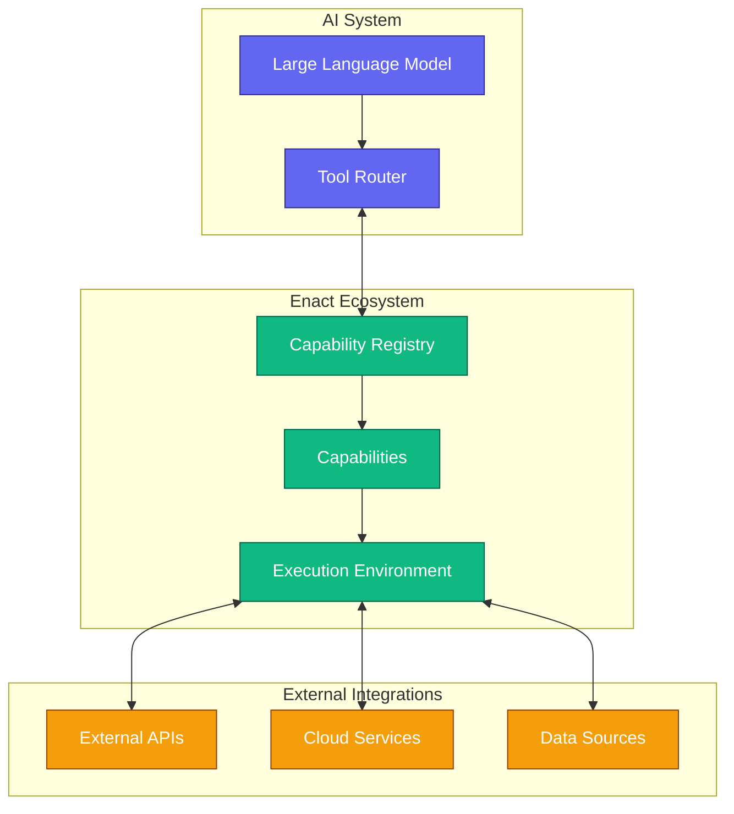
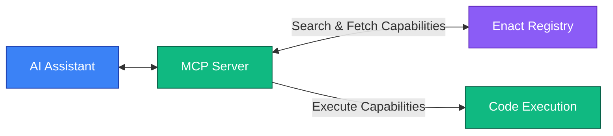

# Enact Protocol (Enact)

  [](https://discord.gg/mMfxvMtHyS)

The **Enact Protocol (Enact)** provides a standardized framework for defining and executing tasks. It enables the creation of reusable, composable, and verifiable capabilities that can be discovered and executed by AI agents and other automated systems.

## Overview

At its simplest, an Enact capability is a task with a structured description in YAML:

```yaml
enact: 1.0.0
id: HelloWorld
description: A simple Hello World example
version: 1.0.0
type: python
run: |
  def main():
    print("Hello World")
    return {"message": "Hello World"}
```

Enact addresses a critical need in the AI ecosystem: as AI agents become more capable, they require reliable access to a diverse set of reliable tools and capabilities. Enact provides a standardized protocol for defining, discovering, and executing tasks that AI agents can use at runtime. Think of it as a universal interface between AI agents and the tools they need to get things done.

## Architecture

The Enact Protocol consists of several key components that work together:



## Core Concepts

### Capabilities

Capabilities are the basic building blocks of the Enact Protocol. Each **capability** is defined in YAML that follows the Enact Protocol Schema.
**Required Fields:**
```yaml
enact: 1.0.0              # Protocol version
id: string                # Unique identifier
description: string       # What the capability does
version: 1.0.0            # Capability version

type: python|javascript|prompt|shell|workflow  # Execution environment
authors:                  # List of authors (optional)
  - name: string
    email: string         # Optional
inputs:                   # Input parameters (JSON Schema)
  type: object
  properties: {}          # JSON Schema properties
  required: []            # Required property names
run: string|array         # Implementation code or composite workflow
outputs:                  # Output parameters (JSON Schema)
  type: object
  properties: {}          # JSON Schema properties
  required: []            # Required property names
```


**Example: Temperature Converter**

```yaml
enact: 1.0.0
id: TemperatureConverter
description: Converts temperature from Celsius to Fahrenheit
version: 1.0.0
type: python
authors:
  - name: John Smith
    email: john@example.com
inputs:
  type: object
  properties:
    celsius:
      type: number
      description: Temperature in Celsius
      minimum: -273.15
  required: ["celsius"]
run: |
  def main(celsius):
    fahrenheit = celsius * 9/5 + 32
    return {"fahrenheit": fahrenheit}
outputs:
  type: object
  properties:
    fahrenheit:
      type: number
      description: Temperature in Fahrenheit
  required: ["fahrenheit"]
```

### Types

Enact supports various execution environments specified directly in the `type` field:

- **`python`**: Execute Python code
- **`javascript`**: Execute JavaScript code
- **`shell`**: Execute shell commands
- **`prompt`**: Return a prompt template for LLMs
- **`workflow`**: Chain multiple capabilities together

### Parameter Management with JSON Schema

**Input Parameters with JSON Schema:**
```yaml
inputs:
  type: object
  properties:
    paramName:
      type: string        # Data type (string, number, boolean, object, array)
      description: string # Parameter description
      format: string      # Optional format specifier
      default: any        # Optional default value
      # Any other JSON Schema validation keywords
  required: ["param1", "param2"]  # Array of required parameter names
```

**Output Parameters with JSON Schema:**
```yaml
outputs:
  type: object
  properties:
    paramName:
      type: string        # Data type (string, number, boolean, object, array)
      description: string # Parameter description
      format: string      # Optional format specifier
  required: ["param1"]    # Array of required parameter names
```

Enact's parameter definitions are fully compliant with [JSON Schema](https://json-schema.org/overview/what-is-jsonschema), allowing for rich validation and documentation.

### Dependencies

Dependencies define the runtime requirements for executing a capability.

```yaml         
dependencies:
  packages:
    - pandas>=2.0.0     # Simple package and version specifier
    - numpy>=1.24.0
```

**Example with Dependencies:**

```yaml
enact: 1.0.0
id: DataAnalyzer
description: Analyzes numerical data and creates visualizations
version: 1.0.0
type: python
inputs:
  type: object
  properties:
    data:
      type: array
      description: Array of numerical values to analyze
      items:
        type: number
    options:
      type: object
      description: Configuration options for analysis
      properties:
        chart_type:
          type: string
          enum: ["bar", "line", "scatter"]
          default: "line"
  required: ["data"]
dependencies:
  packages:
    - pandas>=2.0.0
    - numpy>=1.24.0
    - matplotlib>=3.7.0
run: |
  import pandas as pd
  import numpy as np
  import matplotlib.pyplot as plt
  
  def main(data, options=None):
      # Implementation using pandas, numpy, and matplotlib...
      
outputs:
  type: object
  properties:
    analysis:
      type: object
      description: Statistical analysis results
    visualization:
      type: string
      format: binary
      description: Base64 encoded plot
  required: ["analysis"]
```

### Environment Variables

Environment variables define the configuration and secrets required for capability execution.

```yaml
env:
  vars:
    API_KEY:
      type: string
      description: "API key for the external service"
      source: "https://api.example.com/get-api-key"
    TIMEOUT:
      type: number
      description: "Request timeout in seconds"
      default: 30
  resources:
    memory: "512MB"  # Required memory allocation
    timeout: "60s"   # Maximum execution time
```

**Environment Variable Properties:**
- `type`: Data type of the environment variable
- `description`: Human-readable description of the variable's purpose
- `source`: Optional URL or instructions for obtaining the variable
- `default`: Optional default value if not provided

All environment variables are treated as secrets by default and should be stored securely.

### Error Handling

It is recommended to handle errors using the standard `outputs` structure:

```yaml
outputs:
  type: object
  properties:
    result:
      type: object
      description: The successful result of the operation
    error:
      type: object
      description: Error information (populated only when an error occurs)
      properties:
        message:
          type: string
          description: Human-readable error message
        code:
          type: string
          description: Machine-readable error code
        details:
          type: object
          description: Additional error details
  oneOf:
    - required: ["result"]
    - required: ["error"]
```

## Schema Validation

Capabilities can be validated against the Enact JSON Schema to ensure they conform to the protocol specification.

## Using with Model Context Protocol (MCP)

Enact capabilities can be dynamically discovered and executed through the Model Context Protocol, enabling AI agents to access the full range of capabilities in the Enact ecosystem.

### MCP Integration

The Enact Protocol works with MCP through two primary mechanisms:

1. **Dynamic Capability Discovery**: 
   - The `enact-search-capabilities` MCP tool allows searching the Enact registry for capabilities that match specific criteria
   - Found capabilities are automatically registered as MCP tools, making them immediately available for use

2. **Direct Capability Execution**:
   - The `execute-capability-by-id` MCP tool provides direct execution of any Enact capability using its ID
   - This allows for execution of capabilities that may not be pre-registered as tools



## Contributing
We welcome contributions to the Enact Protocol! You can start by making a pr or joining our [discord](https://discord.gg/mMfxvMtHyS)

> "Perfection is achieved not when there is nothing more to add, but when there is nothing left to take away."
>
> — *Antoine de Saint-Exupéry*

## License

This project is licensed under the [MIT License](LICENSE).

---

© 2025 Enact Protocol Contributors